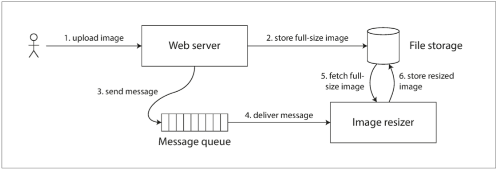
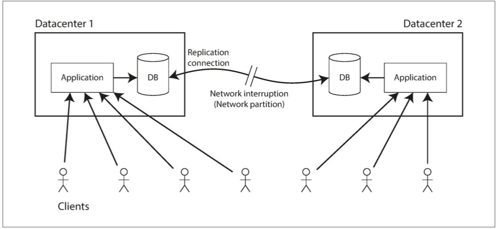

# 一致性与共识

在本章中，我们将讨论构建容错分布式系统的算法和协议的一些例子。假设 [第八章](./8_trouble_in_distributed_system.md) 的所有问题都可能发生：

- 网络中的数据包可能会丢失、重新排序、重复推送或任意延迟；
- 时钟只是尽其所能地近似；
- 节点可以暂停（例如，由于垃圾收集）或随时崩溃。

构建容错系统的最好方法，是找到一些带有实用保证的通用抽象，实现一次，然后让应用依赖这些保证。

- 第七章的事务处理是个实例：通过使用事务，应用可以假装没有崩溃（原子性），没有其他人同时访问数据库（隔离），存储设备是完全可靠的（持久性）。

分布式系统最重要的抽象之一就是 **共识（consensus）**：**就是让所有的节点对某件事达成一致**。

- 一旦达成共识，应用可以将其用于各种目的。
- 重要的是只有一个领导者，且所有的节点都认同其领导。

## 一致性保证

大多数复制的数据库至少提供了 **最终一致性**：如果停止向数据库写入数据并等待一段不确定的时间，那么最终所有的读取请求都会返回相同的值【1】。

- 如果你在同一时刻查看两个数据库节点，则可能在两个节点上看到不同的数据，因为写请求在不同的时间到达不同的节点。
- 在收敛之前，读操作可能会返回任何东西或什么都没有，不具备**读己之写**；

具有较强保证的系统可能会比保证较差的系统具有更差的性能或更少的容错性。

**分布式一致性模型** 和我们之前讨论的事务隔离级别的层次结构有一些相似之处【4,5】

- 事务隔离主要是为了 **避免由于同时执行事务而导致的竞争状态**
- 分布式一致性主要关于 **在面对延迟和故障时如何协调副本间的状态**。

## 线性一致性

**线性一致性（linearizability）**【6】（也称为 **原子一致性（atomic consistency）**【7】，**强一致性（strong consistency）**，**立即一致性（immediate consistency）** 或 **外部一致性（external consistency ）**【8】）。

- 基本的想法是让一个系统看起来好像只有一个数据副本，而且所有的操作都是原子性的。

线性一致性是一个 **新鲜度保证（recency guarantee）**，保障读到的值是最近的、最新的，而不是来自陈旧的缓存或副本。

下图展示了一个关于体育网站的非线性一致例子【9】，Bob 在听到 Alice 惊呼最后得分 **之后**，刷新的请求路由到了一个落后的数据库副本上，手机显示比赛仍在进行。

### 什么使得系统线性一致？

下图显示三个客户端在线性一致数据库中同时读写相同的键 `x`，称为 **寄存器（register）**

- `x` 被称为 **寄存器（register）**，例如，它可以是键值存储中的一个 **键**，关系数据库中的一 **行**，或文档数据库中的一个 **文档**
  - 𝑟𝑒𝑎𝑑(𝑥)⇒𝑣表示客户端请求读取寄存器 `x` 的值，数据库返回值 `v`。
  - 𝑤𝑟𝑖𝑡𝑒(𝑥,𝑣)⇒𝑟 表示客户端请求将寄存器 `x` 设置为值 `v` ，数据库返回响应 `r` （可能正确，可能错误）。

     <b>如果读取请求与写入请求并发，则可能会返回旧值或新值</b>

不足以完全描述线性一致性：如果与写入同时发生的读取可以返回旧值或新值，那么读者可能会在写入期间看到数值在旧值和新值之间来回翻转。

为了使系统线性一致，我们需要添加另一个约束，如下图所示：

- 客户端 A 是第一个读取新的值 `1` 的位置。在 A 的读取返回之后，B 开始新的读取。由于 B 的读取严格发生于 A 的读取之后，因此即使 C 的写入仍在进行中，也必须返回 `1`

    <b>任何一个读取返回新值后，所有后续读取（在相同或其他客户端上）也必须返回新值。</b>

下图显示了一个更复杂的例子【10】，增加了第三种类型的操作：

- 𝑐𝑎𝑠(𝑥,𝑣𝑜𝑙𝑑,𝑣𝑛𝑒𝑤)⇒𝑟 表示客户端请求进行原子性的 **比较与设置**操作。如果寄存器 𝑥 的当前值等于 𝑣𝑜𝑙𝑑 ，则应该原子地设置为 𝑣𝑛𝑒𝑤 。如果 𝑥 不等于 𝑣𝑜𝑙𝑑 ，则操作应该保持寄存器不变并返回一个错误。$r$ 是数据库的响应（正确或错误)

每个操作都在我们认为操作被执行的时候用竖线标出（在每个操作的横柱之内）。这些标记按顺序连在一起，其结果必须是一个有效的寄存器读写序列（**每次读取都必须返回最近一次写入设置的值**）。

- 线性一致性的要求是，**操作标记的连线总是按时间（从左到右）向前移动**，而不是向后移动。

    <b>将读取和写入看起来已经生效的时间点进行可视化。客户端 B 的最后一次读取不是线性一致的</b>

上图有趣的细节需要指出：

- B 的 read(x)，D 的 write(x, 0), A 的 write(x, 1)：B 的读取值是1，因为数据库先处理D的写入，再是A的写入，最后是B的读取。这是可以接受的顺序，因为三个请求是并发的；
- 在客户端 A 从数据库收到响应之前，客户端 B 的读取返回 `1` ，表示写入值 `1` 已成功。这也是可以的：这并不意味着在写之前读到了值，这只是意味着从数据库到客户端 A 的正确响应在网络中略有延迟。
- 此模型不假设有任何事务隔离：另一个客户端可能随时更改值。可以使用原子 **比较并设置（cas）** 操作来检查该值是否未被另一客户端同时更改：B 和 C 的 **cas** 请求成功，但是 D 的 **cas** 请求失败
- 客户 B 的最后一次读取（阴影条柱中）不是线性一致的。该操作与 C 的 **cas** 写操作并发（它将 `x` 从 `2` 更新为 `4` ）。在 B 的读取开始之前，客户端 A 已经读取了新的值 `4` ，因此**不允许 B 读取比 A 更旧的值**。

线性一致性正式的定义【6】更准确地描述了它。通过记录所有请求和响应的时序，并检查它们是否可以排列成有效的顺序，以测试一个系统的行为是否线性一致性是可能的（尽管在计算上是昂贵的）【11】。

> ### 线性一致性与可串行化
>
> **线性一致性** 容易和 [**可串行化**](./7_transaction.md#可串行化) 相混淆：
>
> - **可串行化（Serializability）** 是事务的隔离属性，每个事务可以读写多个对象（行，文档，记录）。确保事务的行为，与它们按照 **某种** 顺序依次执行的结果相同（每个事务在下一个事务开始之前运行完成）。这种执行顺序可以与事务实际执行的顺序不同。【12】
> - **线性一致性（Linearizability）** 是读取和写入寄存器（单个对象）的 **新鲜度保证**。它不会将操作组合为事务，因此它也不会阻止写入偏差等问题（请参阅 “[写入偏差和幻读](./7_transaction.md#写入偏差与幻读)”），除非采取其他措施（例如 [物化冲突](./7_transaction.md#物化冲突)）。
>
> 一个数据库可以提供可串行化和线性一致性，这种组合被称为严格的可串行化或 **强的单副本可串行化（strong-1SR）**【4,13】。基于两阶段锁定的可串行化实现（请参阅 “[两阶段锁定](./7_transaction.md#两阶段锁定)” 一节）或 **真的串行执行**（请参阅 “[真的串行执行](./7_transaction.md#真的串行执行)”一节）通常是线性一致性的。
>
> 可串行化的快照隔离（请参阅 “[可串行化快照隔离](./7_transaction.md#可串行化快照隔离)”）不是线性一致性的：按照设计，它从一致的快照中进行读取，以避免读者和写者之间的锁竞争。一致性快照的要点就在于 **它不会包括该快照之后的写入**，因此从快照读取不是线性一致性的。

### 依赖线性一致性

对于少数领域，线性一致性是系统正确工作的一个重要条件。

#### 锁定和领导选举

一种选择领导者的方法是使用锁：每个节点在启动时尝试获取锁，成功者成为领导者【14】。不管这个锁是如何实现的，它必须是线性一致的：**所有节点必须就哪个节点拥有锁达成一致。**

- Apache ZooKeeper 【15】和 etcd 【16】之类的协调服务通常用于实现分布式锁和领导者选举。
- 使用一致性算法，以容错的方式实现线性一致的操作（在本章后面的 “[容错共识](./9_consistency_consensus.md#容错共识)” 中讨论此类算法）[^1]
- Apache Curator 【17】这样的库则通过在 ZooKeeper 之上提供更高级别的配方来提供帮助

#### 约束和唯一性保证

唯一性约束在数据库中很常见：例如，用户名或电子邮件地址必须唯一标识一个用户；不能有两个具有相同路径和文件名的文件。

- 在写入数据时强制执行此约束，则需要线性一致性。。

这种情况实际上类似于一个锁，与原子性的比较与设置（CAS）非常相似。

- 获得了所选用户名的 “锁”；
- 将用户名赋予声明它的用户，前提是用户名尚未被使用。

约束条件都要求所有节点都同意一个最新的值，如：

- 银行账户余额永远不会为负数，或者两个人不会都预定了航班或剧院里同一时间的同一个位置

实际应用中，宽松地处理这些限制有时是可以接受的。这种情况下，可能不需要线性一致性，我们将在 “[及时性与完整性](./9_consistency_consensus.md#及时性与完整性)” 中讨论这种宽松的约束。

一个硬性的唯一性约束（关系型数据库中常见的那种）需要线性一致性。其他类型的约束，如外键或属性约束，可以不需要线性一致性【19】。

#### 跨信道的时序依赖

由于系统中存在额外的信道（Alice 的声音传到了 Bob 的耳朵中），线性一致性的违背才被注意到。

- 图 9-1 中如果 Alice 没有惊呼得分，Bob 就不会知道他的查询结果是陈旧的。

其它的网站示例，架构如下图所示：

- 用户可以上传照片，一个后台进程会调整照片大小，降低分辨率以加快下载速度（缩略图）

    <b>图 9-5 Web 服务器和图像缩放器通过文件存储和消息队列进行通信，打开竞争条件的可能性。</b>

如果文件存储服务不是线性一致的，则存在竞争条件的风险：

- 消息队列可能比存储服务内部的复制（replication）更快：当缩放器读取图像（步骤 5）时，可能会看到图像的旧版本，或者什么都没有。
- 如果它处理的是旧版本的图像，则文件存储中的全尺寸图和缩略图就产生了永久性的不一致。

出现这个问题是因为 Web 服务器和缩放器之间存在两个不同的信道：文件存储与消息队列。

- 线性一致性并不是避免这种竞争条件的唯一方法，但它是最容易理解的。
- 其他方法解决：不同的文件名/文件的时间？文件存储后再异步调用进行缩放？

### 实现线性一致的系统

> 线性一致性本质上意味着 “表现得好像只有一个数据副本，而且所有的操作都是原子的”

使系统容错最常用的方法是使用复制，比较各种复制方法是否可以满足线性一致性：

- 单主复制（可能线性一致）
  - 如果**从主库或同步更新的从库**读取数据，它们 **可能（potential）** 是线性一致性的[^2]
- 共识算法（线性一致）
  - 共识协议包含防止脑裂和陈旧副本的措施，如Zookeeper 【21】和 etcd 【22】
- 多主复制（非线性一致）
  - 同时在多个节点上处理写入，并将其异步复制到其他节点。
- 无主复制（也许不是线性一致的）
  - 通过要求法定人数读写（ 𝑤+𝑟>𝑛 ）可以获得 “强一致性”。这取决于法定人数的具体配置，以及强一致性如何定义（通常不完全正确）。
  - 基于日历时钟的 “最后写入胜利” 冲突解决方法几乎可以确定是非线性一致的：因为时钟偏差不能保证时钟的时间戳与实际事件顺序一致。
  - 宽松的法定人数也破坏了线性一致的可能性。
  - 即使使用严格的法定人数，非线性一致的行为也是可能的，如下节所示。

#### 线性一致性和法定人数

当我们有可变的网络延迟时，对于严格的法定人数读写，就可能存在竞争条件，如下图所示。

- $x$ 的初始值为 0，写入客户端通过向所有三个副本（ 𝑛=3,𝑤=3 ）发送写入将 $x$ 更新为 `1`；
- 客户端 A 并发地从两个节点组成的法定人群（ 𝑟=2 ）中读取数据，并在其中一个节点上看到新值 `1`；
- 客户端 B 也并发地从两个不同的节点组成的法定人数中读取，并从两个节点中取回了旧值 `0` 。

法定人数条件满足（ 𝑤+𝑟>𝑛 ），但是这个执行是非线性一致的：B 的请求在 A 的请求完成后开始，但是 B 返回旧值，而 A 返回新值。

    <b>图 9-6 非线性一致的执行，尽管使用了严格的法定人数</b>

通过牺牲性能，可以使 Dynamo 风格的法定人数线性化：

- 读取者必须在将结果返回给应用之前，同步执行[读修复](./5_replication.md#读修复和反熵)。并且写入者必须在发送写入之前，读取法定数量节点的最新状态【24,25】。
- 只能实现线性一致的读写；不能实现线性一致的比较和设置（CAS）操作，因为它需要一个共识算法【28】。

最安全的做法是：假设采用 Dynamo 风格无主复制的系统不能提供线性一致性。

### 线性一致性的代价

对多数据中心的复制而言，多主复制通常是理想的选择。如果两个数据中心之间发生网络中断会发生什么？

    <b>图 9-7 网络中断迫使在线性一致性和可用性之间做出选择。</b>

#### CAP定理

> 一致性，可用性和分区容错性：三者只能择其二。不幸的是这种说法很有误导性【32】，因为网络分区是一种故障类型，所以它并不是一个选项：不管你喜不喜欢它都会发生【38】。
>
> CAP 定理【29,30,31,32】由 Eric Brewer 于 2000 年命名，尽管 70 年代的分布式数据库设计者早就知道了这种权衡【33,34,35,36】。

CAP 更好的表述成：在分区时要么选择一致，要么选择可用【39】。

- 许多所谓的 “高可用”（容错）系统实际上不符合 CAP 对可用性的特殊定义。
- 围绕着 CAP 有很多误解和困惑，并不能帮助我们更好地理解系统，所以最好避免使用 CAP。

CAP 定理的正式定义仅限于很狭隘的范围【30】，它只考虑了一个一致性模型（即线性一致性）和一种故障（网络分区 [6](https://github.com/Vonng/ddia/blob/master/ch9.md#user-content-fn-vi-c5c5b6a1339c955cf00457bbf10c828d)，或活跃但彼此断开的节点）

- 尽管 CAP 在历史上有一些影响力，但对于设计系统而言并没有实际价值【9,40】。

在分布式系统中有更多有趣的 “不可能” 的结果【41】，且 CAP 定理现在已经被更精确的结果取代【2,42】。

#### 线性一致性和网络延迟

实际上，线性一致的系统惊人的少。现代多核 CPU 上的内存甚至都不是线性一致的【43】：

- 如果一个 CPU 核上运行的线程写入某个内存地址，而另一个 CPU 核上运行的线程不久之后读取相同的地址，并没有保证一定能读到第一个线程写入的值（除非使用了 **内存屏障（memory barrier）** 或 **围栏（fence）**【44】）。

- 默认情况下，内存访问首先走缓存，任何变更会异步写入主存。因为缓存访问比主存要快得多【45】。
- 牺牲线性一致性的原因是 **性能（performance）**，而不是容错。不指望一个 CPU 核能在脱离计算机其他部分的条件下继续正常工作。

许多分布式数据库也是如此：它们是 **为了提高性能** 而选择了牺牲线性一致性，而不是为了容错【46】。

Attiya 和 Welch 【47】证明，如果你想要线性一致性，读写请求的响应时间至少与网络延迟的不确定性成正比。

- **更快地线性一致算法不存在，但更弱的一致性模型可以快得多**，所以对延迟敏感的系统而言，这类权衡非常重要。

## 顺序保证

**顺序（ordering）** 这一主题在本书中反复出现，这表明它可能是一个重要的基础性概念。

- 第五章（复制）领导者在单主复制中的主要目的就是，在复制日志中确定**写入顺序（order of write）**（从库应用这些写入的顺序）。
- 第七章（事务）**可串行化**，是关于事务表现的像按 **某种先后顺序（some sequential order）** 执行的保证。
- 第八章（分布式系统）使用时间戳和时钟是另一种将顺序引入无序世界的尝试，例如确定两个写入操作哪一个更晚发生。

事实证明，顺序、线性一致性和共识之间有着深刻的联系。

### 顺序与因果关系

**顺序**有助于保持 **因果关系（causality）**。

- “[一致前缀读](./5_replication.md#一致前缀读)”：先有问题再有答案；
- 在 “[检测并发写入](./5_replication.md#检测并发写入)” ：有两个操作 A 和 B，则存在三种可能性：A 发生在 B 之前，或 B 发生在 A 之前，或者 A 和 B**并发**。**此前发生（happened before）** 关系是因果关系的另一种表述。
- 事务之间 **写偏差（write skew）** 的例子也说明了因果依赖。

快照隔离提供了因果一致性：

#### 因果顺序不是全序的

[^1]: 严格地说，ZooKeeper 和 etcd 提供线性一致性的写操作，但读取可能是陈旧的，因为默认情况下，它们可以由任何一个副本提供服务。你可以选择请求线性一致性读取：etcd 称之为 **法定人数读取（quorum read）**【16】，而在 ZooKeeper 中，你需要在读取之前调用 `sync()`【15】。请参阅 “[使用全序广播实现线性一致的存储](./9_consistency_consensus.md#使用全序广播实现线性一致的存储)”。
[^2]: 对单主数据库进行分区（分片），使得每个分区有一个单独的领导者，不会影响线性一致性，因为线性一致性只是对单一对象的保证。交叉分区事务是一个不同的问题（请参阅 “[分布式事务与共识](./9_consistency_consensus.md#分布式事务与共识)”）
