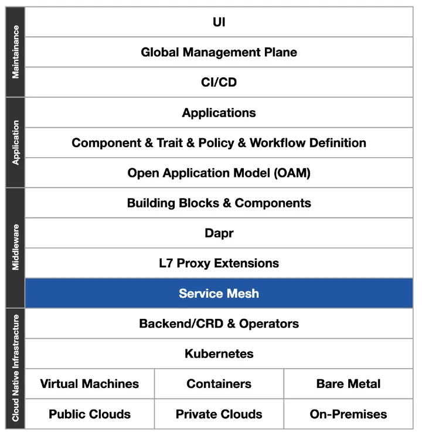

# 云原生

## 定义

[CNCF的定义](https://github.com/cncf/toc/blob/main/DEFINITION.md#%E4%B8%AD%E6%96%87%E7%89%88%E6%9C%AC)

> 云原生技术有利于各组织在公有云、私有云和混合云等新型动态环境中，构建和运行**可弹性扩展的应用**。云原生的代表技术包括容器、服务网格、微服务、不可变基础设施和声明式API。
>
> 这些技术能够构建容错性好、易于管理和便于观察的松耦合系统。结合可靠的自动化手段，云原生技术使工程师能够轻松地对系统作出频繁和可预测的重大变更。

## 设计理念

- 面向**分布式**设计（Distribution）：容器、微服务、API 驱动的开发；
- 面向**配置**设计（Configuration）：一个镜像，多个环境配置；
- 面向**韧性**设计（Resistancy）：故障容忍和自愈；
- 面向**弹性**设计（Elasticity）：弹性扩展和对环境变化（负载）做出响应；
- 面向**交付**设计（Delivery）：自动拉起，缩短交付时间；
- 面向**性能**设计（Performance）：响应式，并发和资源高效利用；
- 面向**自动化**设计（Automation）：自动化的 DevOps；
- 面向**诊断性**设计（Diagnosability）：集群级别的日志、metric 和追踪；
- 面向**安全性**设计（Security）：安全端点、API Gateway、端到端加密；

## 技术栈

[CNCF Landscape](https://landscape.cncf.io/?group=wasm)

## 参考文献

[1].  [Kubernetes 中文指南/云原生应用架构实战手册](https://jimmysong.io/kubernetes-handbook)

