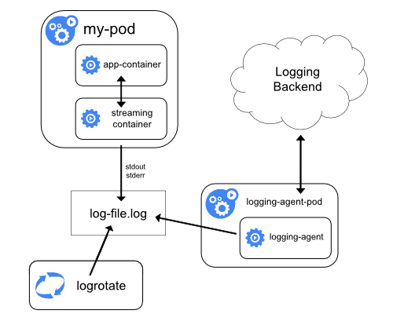

# 日志架构

 针对容器化应用，最简单且最广泛采用的日志记录方式就是**写入标准输出和标准错误流**。但是，由容器引擎或运行时提供的原生功能通常不足以构成完整的日志记录方案。

例如，如果发生容器崩溃、Pod 被逐出或节点宕机等情况，你可能想访问应用日志。

 在集群中，日志应该具有**独立的存储和生命周期**，与节点、Pod 或容器的生命周期相独立。 这个概念叫 ***集群级的日志*** 。

## Pod 和容器日志

### 节点对容器日志的处理方式

容器化应用写入 **`stdout`** 和 **`stderr`** 的任何数据，都会被**容器引擎捕获并被重定向到某个位置**。

不同的容器运行时以不同的方式实现这一点；不过它们与 kubelet 的集成都被标准化为 **CRI 日志格式**。

- Pod的日志位置：`/var/log/pods/*/*.log`；

### 日志轮转

节点级日志记录中，需要重点考虑**实现日志的轮转**，以此来保证日志不会消耗节点上全部可用空间。

kubelet 负责轮换容器日志并管理日志目录结构。

- kubelet（使用 CRI）将此信息发送到容器运行时，而**运行时则将容器日志写到给定位置**。

- `containerLogMaxSize` （默认 10Mi）和 `containerLogMaxFiles`（默认 5）

- `kubectl logs` 仅可查询到最新的日志内容，滚动的日志无法查看；

### 系统组件日志

系统组件有两种类型：**在容器中运行**的和**不在容器中运行**的。例如：

- 在容器中运行的 **kube-scheduler, kube-proxy, kube-apiserver, kube-controller-manager**；
  - 将日志写到 `/var/log` 目录，绕过了默认的日志机制，使用 [klog](https://github.com/kubernetes/community/blob/master/contributors/devel/sig-instrumentation/logging.md) 日志库；
- 不在容器中运行的 **kubelet** 和**容器运行时**；
  - 使用 **systemd 机制**的Linux上，kubelet 和容器容器运行时将日志写入到 [**journald**](../../linux/journald.md) 中。 使用`journalctl -u kubelet`查看日志。
  - 如果没有 systemd，它们将日志写入到 `/var/log` 目录下的 `.log` 文件中
- `/var/log` 目录中的系统组件日志，被工具 `logrotate` 执行每日轮转，或者日志大小超过 100MB 时触发轮转；

## 集群级日志架构

虽然 Kubernetes 没有为集群级日志记录提供原生的解决方案，以下是一些选项：

- 使用在每个节点上运行的节点级日志记录代理。
- 在应用程序的 Pod 中，包含专门记录日志的边车（Sidecar）容器。
- 将日志直接从应用程序中推送到日志记录后端。

### 使用节点级日志代理

每个节点上使用**节点级的日志记录代理**来实现集群级日志记录。

- 推荐以 `DaemonSet` 的形式运行该代理。
- 容器向标准输出和标准错误输出写出数据，但在格式上并不统一。 节点级代理收集这些日志并将其进行转发以完成汇总。

### 使用边车容器运行日志代理

以下方式之一使用边车（Sidecar）容器：

- 边车容器将应用程序日志传送到自己的标准输出。
- 边车容器运行一个日志代理，配置该日志代理以便从应用容器收集日志。

#### 传输数据流的边车容器 

应用程序将日志写到文件中，边车容器读取该文件并输出到 `stdout`和`stderr`中

- 允许你将日志流从应用程序的不同部分分离开，如存在多种不同格式的输出文件；
- 可以使用内置的工具 `kubectl logs`，查看的是边车容器的的`stdout`和`stderr`；

集群中安装的节点级代理会自动获取这些日志流，而无需进一步配置。

#### 具有日志代理功能的边车容器

创建一个带有单独日志记录代理的边车容器，将代理程序专门配置为与你的应用程序一起运行。

- 在边车容器中使用日志代理会带来严重的资源损耗；
- 不能使用 `kubectl logs` 访问日志，因为日志并没有被 kubelet 管理。

### 从应用中直接暴露日志目录

从各个应用中直接暴露和推送日志数据的集群日志机制已超出 Kubernetes 的范围。

## 参考文档

1.  [日志架构 | Kubernetes 官方](https://kubernetes.io/zh-cn/docs/concepts/cluster-administration/logging/#cluster-level-logging-architectures)