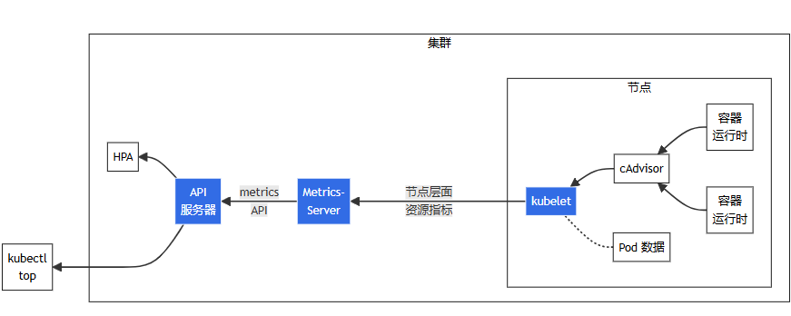

# 指标监控

## K8s资源监控指标

> Metrics API 及其启用的指标管道仅提供最少的 CPU 和内存指标，以启用使用 HPA 和/或 VPA 的自动扩展。 如果你想提供更完整的指标集，可以通过部署第二个指标管道（使用 **Custom Metrics API** ）来作为简单的 Metrics API 的补充。



### cAdvisor

> Analyzes resource usage and performance characteristics of running containers.
>
> 用于收集、聚合和公开 Kubelet 中包含的**容器指标**的守护程序。

目前 **cAdvisor集成到kubelet组件**内，可以在kubernetes集群中每个启动了kubelet的节点使用cAdvisor提供的metrics接口获取**该节点所有容器相关的性能指标数据**。

从api server访问cadvisor的地址：

- cAdvisor的metrics地址: `/api/v1/nodes/[节点名称]/proxy/metrics/cadvisor`

直接从各个node的 kubelet 访问cadvisor的地址：

- cAdvisor的metrics地址: `node_ip:10250/metrics/cadvisor`

### Aggregator

> **kubeadm 部署的 K8s 集群，Aggregator 模式默认开启**。
>
> - kube-aggregator 根据URL选择具体的API后端的代理服务器，将第三方服务注册到 Kubernetes API 中。

```shell
--requestheader-client-ca-file=<path to aggregator CA cert>
--requestheader-allowed-names=front-proxy-client
--requestheader-extra-headers-prefix=X-Remote-Extra-
--requestheader-group-headers=X-Remote-Group
--requestheader-username-headers=X-Remote-User
--proxy-client-cert-file=<path to aggregator proxy cert>
--proxy-client-key-file=<path to aggregator proxy key>
```

对于`metrics.k8s.io`的指标，代理到后端的`metrics-server`


### [Metrics Server](https://github.com/kubernetes-sigs/metrics-server)

> - Metrics Server is a scalable, efficient source of container resource metrics for Kubernetes **built-in autoscaling pipelines**. Metrics Server is **meant only for autoscaling purposes**. 

Metrics-serve **基于cAdvisor** 收集指标数据，获取、格式化后以 [metrics API](https://github.com/kubernetes/metrics) 的形式从 apiserver 对外暴露，核心作用是为 kubectl top 以及 HPA/VPA 等组件提供决策指标支持。

- 每15秒收集一次指标，每个节点使用 1 mili core CPU和 2 MB内存。
- 轻量级的、短期、内存存储。

通过标准的 K8s API 访问监控数据：

- Pod的监控：`/apis/metrics.k8s.io/v1beta1/namespaces/<namespace-name>/pods/<pod-name>`

如果 metrics server 的 pod 存在，但是 `kubectl top pods` 报错：“No Metrics for pods ...”

- `kubectl get --raw /api/v1/nodes/${nodeIP}/proxy/metrics/resource` 查看是否有 pod 的 cpu / memory 的指标；
- 如果没有，则重启 kubelet：`systemctl restart kubelet.service`

#### 安装

Metrics Server 并不是 kube-apiserver的一部分，而是**通过 Aggregator 插件机制**。

- 要求 k8s apiserver 必须**启用聚合层**，[K8s 版本兼容性矩阵](https://github.com/kubernetes-sigs/metrics-server?tab=readme-ov-file#compatibility-matrix)

```shell
kubectl apply -f https://github.com/kubernetes-sigs/metrics-server/releases/latest/download/components.yaml
```


### [Custom Metrics](https://github.com/kubernetes-sigs/prometheus-adapter)

通过查询 Prometheus 的指标，暴露 custom metrics。


## K8s对象状态监控

[kube-state-metrics](https://github.com/kubernetes/kube-state-metrics)插件代理可以连接到 Kubernetes API 服务器并公开一个 HTTP 端点，提供集群中各个对象的状态所生成的指标。 

此代理公开了关于对象状态的各种信息，如**标签和注解、启动和终止时间、对象当前所处的状态或阶段**。

例如，针对运行在 Pod 中的容器会创建一个 `kube_pod_container_info` 指标。 其中包括容器的名称、所属的 Pod 的名称、Pod 所在的[命名空间](https://kubernetes.io/zh-cn/docs/concepts/overview/working-with-objects/namespaces/)、 容器镜像的名称、镜像的 ID、容器规约中的镜像名称、运行中容器的 ID 和用作标签的 Pod ID。


## NVIDIA GPU Metrics

> [NVIDIA/dcgm-exporter: NVIDIA GPU metrics exporter for Prometheus leveraging DCGM](https://github.com/NVIDIA/dcgm-exporter)


## GoGlient使用

### 集群总的资源信息/节点的总资源信息

通过 client-go 获取所有的 Nodes 信息，将资源进行汇聚

```go
// this code is copied from kubedl project.
func (ov *DataHandler) GetClusterTotalResource() (model.ClusterTotalResource, error) {
    nodes := &corev1.NodeList{}
    err := client.List(context.TODO(), nodes)
    if err != nil {
        klog.Errorf("GetClusterTotalResource Failed to list nodes")
        return model.ClusterTotalResource{}, err
    }
    totalResource := corev1.ResourceList{}
    for _, node := range nodes.Items {
        allocatable := node.Status.Allocatable.DeepCopy()
        totalResource = resources.Add(totalResource, allocatable)
    }
    clusterTotal := model.ClusterTotalResource{
        TotalCPU:    totalResource.Cpu().MilliValue(),
        TotalMemory: totalResource.Memory().Value(),
        TotalGPU:    getGpu(totalResource).MilliValue()}
    return clusterTotal, nil
}
// get gpu from custom resource map
func getGpu(resourceList corev1.ResourceList) *resource.Quantity {
	if val, ok := (resourceList)["nvidia.com/gpu"]; ok {
		return &val
	}
	return &resource.Quantity{Format: resource.DecimalSI}
}
```


### 集群已使用的资源信息/节点已使用的资源信息

获取在每个节点上的Pod，对于 Phase 为 Running 的 Pod 计算总的资源申请：

- 通过 controller-runtime 的 client 对 `pod.spec.nodeName`进行 index，提升 List 效率，可参考 [kubedl](https://github.com/kubedl-io/kubedl/blob/434352b51ce11c7a3508ec8ad651329ab761a9a9/console/backend/pkg/handlers/data.go#L29)；


### 运行中的 Pod 的资源使用情况

通过 Metrics Server 可以获取 Pod 的 CPU/Memory 的实时使用信息。

- 或者通过go pkg [metrics api](https://github.com/kubernetes/metrics)访问

```shell
$ curl -ik -H "Authorization: Bearer $TOKEN" https://k8s.hc.cn:6443/apis/metrics.k8s.io/v1beta1/namespaces/default/pods/
```

结果如下：

```json
{
  "kind": "PodMetricsList",
  "apiVersion": "metrics.k8s.io/v1beta1",
  "metadata": {
    "selfLink": "/apis/metrics.k8s.io/v1beta1/namespaces/default/pods/"
  },
  "items": [
    // 每个 Pod 的 CPU / GPU 使用情况
    {
      "metadata": {
        "name": "minio-7d66769f84-4qw52",
        "namespace": "default",
        "selfLink": "/apis/metrics.k8s.io/v1beta1/namespaces/default/pods/minio-7d66769f84-4qw52",
        "creationTimestamp": "2024-02-20T07:03:29Z"
      },
      "timestamp": "2024-02-20T07:02:49Z",
      "window": "30s",
      "containers": [
        {
          "name": "minio",
          "usage": {
            "cpu": "201812n",
            "memory": "92596Ki"
          }
        }
      ]
    },
    ...
  ]
}
```


## 参考文档

1. [资源监控工具 | Kubernetes](https://kubernetes.io/zh-cn/docs/tasks/debug/debug-cluster/resource-usage-monitoring/)
1. [Kubernetes 对象状态的指标 | Kubernetes](https://kubernetes.io/zh-cn/docs/concepts/cluster-administration/kube-state-metrics/)

