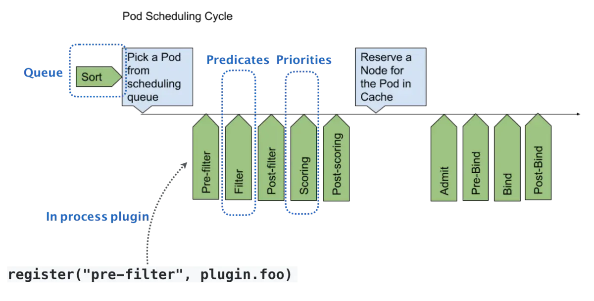
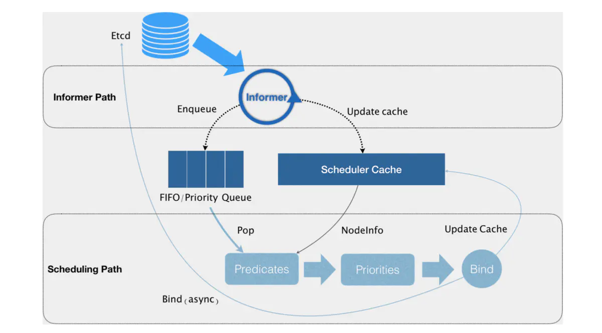

# K8s调度器

## 污点与容忍度

默认情况下，Master节点是不允许运行用户Pod的。通过`Taint/Toleration`机制，可以在Master节点部署用户Pods。

**原理**：节点被加上一个Taint（染上“污点“），如果节点未声明自己能够容忍该”污点”（Toleration），则Pod不能在上面运行。

节点加上“污点”的命令：

- **NoSchedule意味着该Taint只会在调度新的Pod时产生作用，不会影响node1上已经运行的Pods**

```bash
$ kubectl taint nodes node1 foo=bar:NoSchedule
```

Pod声明Toleartion：

```yaml
# 能够容忍所有键值对为foo=bar的Taint
apiVersion: v1
kind: Pod
...
spec:
  toleartions:
    - key: "foo"
      operation: "Equal"
      value: "bar"
      effect: "NoSchedule"
```

节点删除“污点”的命令：让Master节点可以运行Pod

```bash
# 删除所有节点的node-role.kubernetes.io/master的Taint（最后的减号表示删除）
$ kubectl taint nodes --all node-role.kubernetes.io/master -
```


## 资源限制

> requests + limits : 大多数作业用到的资源其实远少于它所请求的资源限额
>
> - 声明较小的requests值供**调度器**使用；
> - 给容器Cgroups设置的limits值相对较大；

### 资源类型

**针对每个container**，都可以配置:

```yaml
spec.containers[].resources.limits.cpu
spec.containers[].resources.limits.memory
spec.containers[].resources.limits.ephemeral-storage
spec.containers[].resources.requests.cpu
spec.containers[].resources.requests.memory
spec.containers[].resources.requests.ephemeral-storage
```

### Qos模型

> 根据 requests 和 limits，将 Pod 划分为不同的 Qos 级别。
>
> - 配置DaemonSet时资源副本控制器，Qos的等级务必为Guaranteed

**Guaranteed**：requests 和 limits 相等时（如果只设置limits，则requests等于limits）；

**Burstable**：不满足 Guaranteed 条件，但至少一个Container设置 requests；

**BestEffort**：既没有 requests，也没有 limits；

当宿主机当不可压缩资源短缺时（如内存，磁盘）时，kubelet 对 Pod 进行 Eviction（资源回收）：

- Soft Eviction：到达阈值一段时间后才会进行 Eviction；
- Hard Eviction：到达阈值后立即开始；

```yaml
# 默认配置，kubelet 启动时可配
memory.available < 100Mi
nodefs.available < 10&
nodefs.inodesFree < 5%
iamgefs.available < 15%
```

当宿主机的 Eviction 阈值达到后，进入 MemoryPressure 或 DiskPressure 状态，避免新的 Pod 被调度到该宿主机，删除Pod的优先级：

- 首先，BestEffort 类别 Pod 优先删除；
- 其次，Burstable类别，且发生“饥饿”的资源使用量超出 requests 的 Pod；
- 最后，Guaranteed类别，且只有当 Guaranteed 类别的 Pod 的资源使用量超过 limits 限制，或者宿主机本身处于 Memory Pressure 状态时，Guaranteed 类别的 Pod 才可能被选中进行 Eviction 操作；


**资源使用量超出 `limits` 的后果**

CPU：

- Container CPU 使用量可能允许超过 limit，也可能不允许；
- Container **CPU 使用量超过 limit 之后，并不会被干掉**。

Memory：

- 如果 container 的**内存使用量超过 request**，那这个 node 内存不足时， 这个 **Pod 可能会被驱逐**；
- Container 的**内存使用量超过 limit** 时，可能会被干掉（OOMKilled）。如果可重启，kubelet 会重启它。


**Node 资源紧张时，按 QoS 分配资源比例**

但只要 Guaranteed pods 需要资源，这些低优先级的 pods 就必须及时释放资源。 如何释放呢？

对于 CPU 等 compressible resources，可以通过 CPU CFS shares，针对每个 QoS 分配一定比例的资源，确保在 CPU 资源受限时，每个 pod 能获得它所申请的 CPU 资源。

对于 `burstable` cgroup,

```ini
/burstable/cpu.shares            = max(sum(Burstable pods cpu requests), MinShares) # MinShares == 2
burstableLimit                  := allocatable — qosMemoryRequests[PodQOSGuaranteed]*percentReserve/100
/burstable/memory.limit_in_bytes = burstableLimit
```

对于 `bestEffort` cgroup,

```ini
/besteffort/cpu.shares            = MinShares # MinShares == 2
bestEffortLimit                  := burstableLimit — qosMemoryRequests[PodQOSBurstable]*percentReserve/100
/besteffort/memory.limit_in_bytes = bestEffortLimit
```

这几个 cgroup [初始化之后](https://github.com/kubernetes/kubernetes/blob/v1.26.0/pkg/kubelet/cm/qos_container_manager_linux.go#L81), kubelet 会调用 [`UpdateCgroups()`](https://github.com/kubernetes/kubernetes/blob/v1.26.0/pkg/kubelet/cm/qos_container_manager_linux.go#L305) 方法来定期更新这三个 cgroup 的 resource limit。


### cpuset

> 将容器绑定到某个 CPU 核上，减少CPU之间的上下文切换，提升容器性能。

通过将 Pod 的 CPU 资源的 requests 和 limits 的值设置为相等即可达到 cpuset，具体绑定的核由 kubelet 决定。


### 节点资源切分（预留）

不是一台 node 的所有资源都能给 k8s 创建 pod 用

**`[Allocatable] = [NodeCapacity] - [KubeReserved] - [SystemReserved] - [HardEvictionThreshold]`**

- Allocatable：可以分配给 Pod 的资源信息
- NodeCapacity：节点的资源信息

资源预留（切分）相关的 kubelet 命令参数：

- `--system-reserved=""`
- `--kube-reserved=""`
- `--qos-reserved=""`
- `--reserved-cpus=""`

是否需要对这些 reserved 资源用**专门的 cgroup 来做资源限额**（默认不启用），以确保彼此互不影响：

- `--kube-reserved-cgroup=""`
- `--system-reserved-cgroup=""`

通过 kubelet 的config文件`/var/lib/kubelet/config.yaml`，可以查看相关参数信息

### Cgroup Runtime Driver

k8s 通过配置 cgroup 来限制 container/pod 能使用的最大资源量。这个配置有**两种实现方式**， 在 k8s 中称为 cgroup runtime driver：

1. **`cgroupfs`**

   这种比较简单直接，kubelet **往 cgroup 文件系统中写 limit** 就行。 这也是目前 k8s 的默认方式。

2. **`systemd`**

   所有 cgroup-writing 操作都必须**通过 systemd 的接口**，不能手动修改 cgroup 文件。 适用于 k8s cgroup v2 模式。

### kubelet Cgroup 层级

> cgroup v1 的说明。

kubelet 会在 node 上创建了 4 个 cgroup 层级，从 node 的 **root cgroup** （一般都是 **`/sys/fs/cgroup`**）往下：

1. **Node 级别**：针对 SystemReserved、KubeReserved 和 k8s pods 分别创建的三个 cgroup；
2. **QoS 级别**：在 `kubepods` cgroup 里面，又针对三种 pod QoS 分别创建一个 sub-cgroup：
3. **Pod 级别**：每个 pod 创建一个 cgroup，用来限制这个 pod 使用的总资源量；
4. **Container 级别**：在 pod cgroup 内部，限制单个 container 的资源使用量。


#### Pod 级别 Cgroup

为了防止一个 pod 的多个容器使用资源超标，k8s 引入了 引入了 pod-level cgroup，每个 pod 都有自己的 cgroup

- 某些资源是这个 pod 的所有 container 共享的；
- 每个 pod 也有自己的一些开销，例如 sandbox container；
- Pod 级别还有一些内存等额外开销；

#### QoS 级别 cgroup

kubelet **`--cgroups-per-qos=true`** 参数（默认为 true）， 就会将所有 pod 分成三种 QoS，优先级从高到低：**`Guaranteed > Burstable > BestEffort`**。 

每个 QoS 对应一个子 cgroup，设置**该 QoS 类型的所有 pods 的总资源限额**， 三个 cgroup 共同构成了 `kubepods` cgroup。 

每个 QoS cgroup 可以认为是一个资源池，每个池子内的 pod 共享资源。

#### Node 级别 cgroup

所有的 k8s pod 都会落入 `kubepods` cgroup；

- 所有 k8s pods 占用的资源都已经通过 cgroup 来控制，剩下的是 k8s 组件自身和操作系统基础服务所占用的资源，即 `KubeReserved` 和 `SystemReserved`
- k8s 无法管理这两种服务的资源分配，但能管理它们的限额：有足够权限给它们创建并设置 cgroup （kubelet 的参数）
  - `--kube-reserved-cgroup=""`和`--system-reserved-cgroup=""`，**默认为空，表示不创建**，也就是系统组件和 pod 之间并没有严格隔离。

### cgroup (v1) 配置目录

**cgroup root**：`sys/fs/cgroup`

**/kubepods（node 级别配置）**：按 resource controller 类型

- `/sys/fs/cgroup/cpu/kubepods/`
- `/sys/fs/cgroup/memory/kubepods/`

**Qos 级别配置**

- Burstable或BestEffort：**`/sys/fs/cgroup/{controller}/kubepods/{burstable|besteffort}`**
- Guaranteed ：直接就是 **`/sys/fs/cgroup/{controller}/kubepods/`**， 没有单独的子目录
  - 这种类型的 pod 都设置了 limits， 就无需再引入一层 wrapper 来防止这种类型的 pods 的资源使用总量超出限额

**Pod级别配置**：配置在Qos cgroup 配置的下一级

- 如 **`/sys/fs/cgroup/{controller}/kubepods/burstable/{pod_id}/`**

**Container级别配置**：Pod 的下一级

- 如 **`/sys/fs/cgroup/{controller}/kubepods/{pod_id}/{container_id}/`**

### pod的 `requets/limits` 的计算

> 代码：[`ResourceConfigForPod()`](https://github.com/kubernetes/kubernetes/blob/v1.26.0/pkg/kubelet/cm/helpers_linux.go#L119)

pod 的 requests/limits 需要由 kubelet 综合统计 pod 的所有 container 的 request/limits 计算得到。 CPU 和内存的计算方式如下：

```ini
# 计算 pod 的 CPU request，通过 cpu.shares 能实现最小值控制
pod<pod_id>/cpu.shares            = sum(pod.spec.containers.resources.requests[cpu])
# 计算 pod 的 CPU limit，通过 cpu.cfs_quota_us 能实现最大值控制
pod<pod_id>/cpu.cfs_quota_us      = sum(pod.spec.containers.resources.limits[cpu])

# 计算 pod 的 Memory limit
pod<pod_id>/memory.limit_in_bytes = sum(pod.spec.containers.resources.limits[memory])
```

注意，

1. 如果其中**某个 container 的 cpu 字段只设置了 request 没设置 limit**， 则 pod 将只设置 `cpu.shares`，不设置 `cpu.cfs_quota_us`。

2. 如果**所有 container 都没有设置 cpu request/limit**（等效于 `requests==limits==0`）， 则将 pod **cpu.share 将设置为 k8s 定义的最小值 2**。

   ```ini
    pod<pod_id>/cpu.shares = MinShares # const value 2
   ```

   这种 pod 在 node 空闲时最多能使用整个 node 的资源；但 node 资源紧张时，也最先被驱逐。


## 资源配额

资源配额是一个用于限制一个命名空间下资源使用的机制，其包括如下两个对象：

`ResourceQuota`：限制**单个命名空间下的资源使用量**。包括***CPU，内存，存储，资源对象的个数***等等。

`LimitRanger`：为容器的Limits和Requests设置默认值和范围约束。

### ResourceQuota

resourcequota对相当多的资源提供限制，详细内容可参考文档：https://kubernetes.io/docs/concepts/policy/resource-quotas/#compute-resource-quota。

- 示例：为test命名空间设置资源配额

```shell
kubectl apply -f resource.yaml
```

resource.yaml的信息如下：

```yaml
apiVersion: v1
kind: ResourceQuota
metadata:
  name: compute-resources
  namespace: test
spec:
  hard:
    pods: "2"
    requests.cpu: "1"
    requests.memory: 1Gi
    limits.cpu: "2"
    limits.memory: 2Gi
```

- 如上，对pod数量和使用的requests与limits值做了限制。可以使用describe命令查看目前的资源使用量和限制：

```yaml
kubectl describe resourcequotas -n test
```


- 尝试创建两个Pod，再次创建后报错：记得再次创建时修改pod名称

```yaml
apiVersion: v1
kind: Pod
metadata:
  name: high-priority
  namespace: test
spec:
  containers:
  - name: high-priority
    image: ubuntu
    command: ["/bin/sh"]
    args: ["-c", "while true; do echo hello; sleep 10;done"]
    resources:
      requests:
        memory: "1Gi"
        cpu: "500m"
      limits:
        memory: "1Gi"
        cpu: "500m"
```




### LimitRanger

LimitRanger用于为容器设置默认的requests和limits值，以及限制其范围。

- 示例：限制test命名空间下容器的requests值和limits值	
- kubectl config use-context kubernetes-admin@kubernetes
- kubectl apply -f limit.yaml

```yaml
apiVersion: v1
kind: LimitRange
metadata:
  name: memory-range
  namespace: test
spec:
  limits:
  - max: # 限制容器最大limits值
      memory: 20Mi
    min: # 限制容器最小limits值
      memory: 10Mi
    default: # 默认limits值
      memory: 10Mi
    defaultRequest: # 默认requests值
      memory: 10Mi
    type: Container
```

- 如上，如创建Pod时未指定limits和requests值，则自动为其添加requests.memory: 10Mi，limits.memory: 10Mi；
- 如创建时limits.memory值小于10Mi或大于20Mi，则会拒绝该请求。


## Pod 开销

> [Pod 开销 | Kubernetes](https://kubernetes.io/zh-cn/docs/concepts/scheduling-eviction/pod-overhead/)

Pod 本身占用大量系统资源。这些是运行 Pod 内容器所需资源之外的资源。

Pod 的开销是根据与 Pod 的 [RuntimeClass](https://kubernetes.io/zh-cn/docs/concepts/containers/runtime-class/) 相关联的开销在[准入](https://kubernetes.io/zh-cn/docs/reference/access-authn-authz/extensible-admission-controllers/#what-are-admission-webhooks)时设置的


## 默认调度器

职责：为新创建出来的Pod寻找一个合适的节点。



Kubernetes 调度器的核心，**实际上就是两个相互独立的控制循环**。

- **`Informer Path`**：启动一系列 informer，来监听 Etcd 中 Pod、Node、Service 等与调度相关的对象的变化，加入调度队列；
  - 负责对调度器缓存( scheduler cache）进行更新，通过缓存提升算法执行效率；
- **`Scheduling Path`**：不断地从调度队列里出队一个 Pod
  - **Predicate**：从集群所有的节点中根据调度算法选出所有可以运行该Pod的节点；
  - **Priority** ：从第一步结果中，再根据调度算法挑选一个最符合条件的节点作为最终结果；
  - **Bind**：将pod的`spec.nodeNmae`字段填上调度结果的节点名称。

**乐观绑定**（Assume）：**不在这个关键调度步骤中远程访问 API server，在 Bind 阶段，调度器只会更新 Scheduler Cache 里的 Pod 和 Node 信息**

- 再创建一个 Goroutine 来异步向 API server 发起更新 Pod 的请求，来完成真正的 Bind 操作。

- 对应节点的 kubelet 会进行一个 **Admit** 的操作，再次确认该 pod 能否运行在该节点上。

### 优先级和抢占

> 解决 **Pod 调度失败**时该怎么办的问题。
>
> 优先级越高的Pod在调度时会优先出队。

默认情况下，Pod调度失败后，会被暂时“搁置”，直到 Pod 被更新或者集群状态发生变化，调度器才会对 Pod 进行重新调度。

当高优先级的Pod调度失败后，触发“抢占”，调度器在集群中寻找一个节点：

- 该节点上的一个或多个低优先级的Pod被删除后，高优先级的Pod可以被调度到该节点；
- 仅设置`spec.nominatedNodeName`字段，下一个周期进行调度；

```yaml
# 定义 PriorityClass
apiVersion: scheduling.k8s.io/v1
kind: PriorityClass
metadata:
  name: high-priority
value: 1000000
globalDefault: false  # 是否作为系统的默认优先级
description: "This priority class should be used for high priority service pods only."
-----
# Pod使用PriorityClass
apiVersion: v1
kind: Pod
metadata:
  name: nginx
labels:
  env: test
spec:
  containers:
  - name: nginx
    image: nginx
    imagePullPolicy: IfNotPresent
  priorityClassName: high-priority
```

### 默认的调度配置

[默认插件 | Kubernetes](https://kubernetes.io/zh-cn/docs/reference/scheduling/config/#scheduling-plugins) 包括：

- 污点和容忍；
- 节点选择器和亲和性；
- Pod 间亲和性与反亲和性；
- Pod拓朴分布；
- Pod 请求的所有资源检查；
- `NodeResourcesBalancedAllocation`：调度 Pod 时，选择资源使用更为均衡的节点

### [官方调度插件](https://github.com/kubernetes-sigs/scheduler-plugins)

支持：

- [Capacity Scheduling](https://github.com/kubernetes-sigs/scheduler-plugins/blob/master/pkg/capacityscheduling/README.md)：容量调度器；
- [Coscheduling](https://github.com/kubernetes-sigs/scheduler-plugins/blob/master/pkg/coscheduling/README.md)：Gang Scheduling，批量协同调度
  - 通过Pod的调度状态 Wait 保证至少N个Pod可以被一起调度；

- [Node Resources](https://github.com/kubernetes-sigs/scheduler-plugins/blob/master/pkg/noderesources/README.md)
- [Node Resource Topology](https://github.com/kubernetes-sigs/scheduler-plugins/blob/master/pkg/noderesourcetopology/README.md)
- [Preemption Toleration](https://github.com/kubernetes-sigs/scheduler-plugins/blob/master/pkg/preemptiontoleration/README.md)
- [Trimaran](https://github.com/kubernetes-sigs/scheduler-plugins/blob/master/pkg/trimaran/README.md)

自定义调度器见 [自定义调度](./scheduler_plugin.md)


