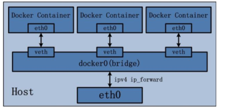

# Moby(Docker)

> **Docker公司直接把原Docker项目改名成了Moby**：https://github.com/moby/moby
>
> 参考书籍：《Docker 容器与容器云》，《深入剖析Kubenetes》

docker  =  image + cgroup + namespace

- image 解决的是打包问题，相对于传统Paas，**保证开发/生产环境的一致性**；
  - 完整的文件系统：rootfs（chroot）；
  - 自定义的打包流程：Dockerfile；
- cgroup 和 namespace 提供运行的沙盒，是Linux的机制，跟传统Paas一致；

## 基础知识

- 镜像是多层存储，每一层的东西并不会在下一层被删除，会一直跟随着镜像；
- 命令行工具docker与Docker daemon建立通信，Docker daemon是Docker守护进程，负责接收并分发执行Docker命令；
- docker命令执行需要获取root权限，绑定属于root的Unix Socket；
- 同一台机器上的所有容器共享主机操作系统的内核。

  - 如果应用程序需要配置内核参数、加载额外内核模块、与内核直接交互，是全局可见的。

- docker镜像运行时，会先创建一个容器初始化进程（dockerinit），完成根目录准备、设备挂载等初始化操作，在通过`execv()`系统调用让应用进程取代自己成为容器`PID=1`的进程；

## 镜像文件

Docker使用了Linux本身的bootfs，只需要安装自己所需的rootfs。

> - 容器Volume里的信息不会被`docker commit`提交，但是挂载点目录会出现在新的镜像中。
>
> - 镜像的层放在`/var/lib/docker/aufs/diff`目录下，被联合挂载在`/var/lib/docker/aufs/mnt`中。

### 联合挂载

镜像设计过程中引入了层（layer）的概念，制作镜像的每一步都会生成一个层，形成增量的rootfs；

- UnionFS：将**不同位置的目录联合挂载（union mount）到同一个目录**下；

#### 读写层

readwrite层，删除foo文件会通过新增`.wh.foo`文件，进行"遮挡"。

docker commit和push指令保存修改过的可读写层，形成新的镜像，共别人使用。

#### Init层

Init层是一个以`-init`结尾的层，夹在只读层和可读写层之间，用于存放`/etc/hosts`、`/etc/resolv.conf`等信息；

- 这些文件本来属于Ubuntu镜像的一部分，但是用户会在启动容器时修改他们，但是这些修改不具备普适性，不应该被commit。

#### 只读层

readonly + whiteout

### 存储驱动

> 支持：aufs, brtfs, device mapper, vfs, overlay2

- 通过`docker info`查看底层`Storage Driver`，centos上为`overlay2`；

docker中使用overlay2存储的原理：https://zhuanlan.zhihu.com/p/41958018

overlay2比overlay更少消耗inode：

- 目录本身也是个文件，且不可进行hardlink，于是上层对下层的引用必须新建一个目录，也占用一个inode。目录里只有目录项，本身体积很小，属于典型的小文件。如果下层的文件结构一复杂，就要创建出很多同款的目录来，对inode资源来说是个巨大的消耗；
- `overlay2`使用了id（层文件夹下的lower文件）映射下层的方式去查找下层文件。查找的过程中，缓存其结果到内存里减少下次查找的时间，减轻了inode创建的大量消耗。

## 资源隔离

基于Linux中的[`Namespace`机制](../../../os/linux/namespace.md)。

### 用户（User Namespace）

> 本节掌握**用户名、组名、用户 id(uid)和组 id(gid)**如何在**容器内的进程和主机系统之间映射**。

***docker 默认并没有启用 user namesapce***。

默认情况下，容器中的进程以 root 用户权限运行，并且这个 **root 用户和宿主机中的 root 是同一个用户**。

> **内核使用的是 uid 和 gid，而不是用户名和组名**，判断对文件的访问权限。

- **内核控制的 uid 和 gid 则仍然只有一套**，**同一个 uid 在宿主机和容器中代表的是同一个用户**（即便在不同的地方显示了不同的用户名）；

通过 docker run 命令的`--user` 参数指定容器中进程的用户身份；

通过 Dockerfile 中的**`RUN useradd -r -u 1000 -g appuser; USER appuser` **添加和指定容器内的用户；

#### 配置

创建 /etc/docker/daemon.json 文件：

```
$ sudo touch /etc/docker/daemon.json
```

然后编辑其内容如下(如果该文件已经存在，仅添加下面的配置项即可)，并重启 docker 服务：

```json
{
  "userns-remap": "default"
}
```

```bash
# docker 会创建了一个名为 dockremap 的用户
# /etc/subuid 和 /etc/subgid 文件中会添加了新用户 dockremap
# /var/lib/docker 目录下会新建了对应的dockremap的目录
$ sudo systemctl restart docker.service
```

### Capability限制

`--cap-add=[] --cap-drop=[]`

超级用户权限被分为若干组，每组代表所能执行的系统调用操作。

容器默认拥有的能力包括：

- **CHOWN**：更改文件UID和GID；
- **DAC_OVERRIDE**：忽略文件的读、写、执行访问权限检查；
- **FSETID**：文件修改后保留setuid/setgid标志位；
- **MKNOD**：使用`mknod`创建指定文件；
- **NET_RAW**：创建RAW和PACKET套接字；
- **SETGID**：改变进程组ID；
- **SETUID**：改变进程用户ID；
- **SETFCAP**：向其他进程转移或删除能力；
- **SYS_REBOOT**：使用`reboot`或`kexec_load`；
- **SYS_CHROOT**：使用chroot；
- **KILL**：发送信号；
- **NET_BIND_SERVICE**：绑定常用端口（< 1024）
- **AUDIT_EDIT**：审计日志写入

## 资源限制

> CPU/Memroy 在容器内是看到限制的，还是宿主机的所有信息？

### 基于[`cgroup`](../../../os/linux/cgroup.md)限制

- Docker daemon 会在单独挂载每一个子系统的控制组目录（如`/sys/fs/cgroup/cpu`）下创建名为docker的控制组；
- 在docker控制组里，为每个容器创建一个以容器ID为名称的容器控制组，容器内的所有进程号会写到该控制组tasks中，并在控制文件中（如`cpu.cfs_quota_us`写入预设置的值）；

### 磁盘资源限制

cgroup不支持对磁盘资源进行限制，而`Quota`技术基于用户和文件系统，而不是基于进程或者目录磁盘限额。

可行方案：

1. 每个容器一个用户，所有用户共享宿主机一块磁盘，仅对普通用户有效；
2. 选择支持对某一个目录可以限额的文件系统，如XFS；
3. 创建虚拟文件系统，此文件系统仅供某一个容器使用。

### 容器流量限制

Trafic Controller 是Linux的流量控制模块，原理是为数据包建立队列，并且定义队列中数据包的发送规则。

### Fork炸弹

快速创建大量进程（指数幂），消耗系统分配进程的可用空间使**进程表饱和**，系统无法运行新程序

- `ulimit`限制最大进程数；
  - **对用户UID进行限制**，而不是对每个容器里能够创建的进程数限制；
- 限制内核内存使用；Cgroup的`memory.kmem.limit_in_bytes`
  - kmen还保存文件系统相关、内核加密等内核数据，限制可能影响其他正常操作；
- cgroup pid子系统；

## 网络

### 单机通信

docker 提供给我们多种(4种)网络模式：

- 默认网络模式 ： bridge；
- 无网络模式 ：none，有独立的network ns，但是需要用户单独配置；
- 宿主网络模式 ：host，不具备独立的network ns；
- 容器网络模式：container，新容器与某个已存在的容器共享network ns，容器间可通过回环网卡通信；

#### Bridge模式

docker0 网卡/网桥：

- 网桥的概念等同于交换机，为连在其上的设备转发数据帧，veth相当于端口，工作在二层，不需要IP信息；
- docker0也是二层设备，但为普通的Linux网桥，可以配置IP，作为容器的默认网关；



Docker安装好时，在iptables配置SNAT规则（源地址转换），可以访问外部

```shell
# 将源地址172.17.0.0/16的数据包（容器内发出的数据）且不是从docker0网卡发出时做SNAT转换
# 这样从容器访问外网流量时，外部看来就是从宿主机发出，不感知容器
-A POSTROUTING -s 172.17.0.0/16 ! -o docker0 -j MASQUEADE
```

容器与外部通信过程中，数据包在多个网卡间的转发（如从docker0网卡到宿主机eth0），需要开启内核的`ip-forward`功能：

```shell
echo 1 > /proc/sys/net/ipv4/ip_forward
```

新增容器运行时，添加iptables规则（让外部可以访问容器服务）做DNAT（目的地址转换）：

- 讲访问宿主机的5000端口的流量转发到172.17.0.4:5000的端口（容器的IP端口）；

```shell
# 启动 web 容器
$ sudo docker run -d -p 5000:5000 traning/webapp python app.py
# 查看 iptalbes 规则
$ sudo iptables-save
...
*nat
-A DOCKER ! -i docker0 -p tcp -m tcp --dport 5000 -j DNAT --to-destination 172.17.0.4:5000
...
*filter
-A DOCKER -d 172.17.0.4/32 ! -i docker0 -o docker0 -p tcp -m tcp --dport 5000 -j ACCEPT
```

容器间互相通信：

- 同一台宿主机的容器都默认连在docker0网桥上，属于一个子网；
- Docker在filter的FORWARD链中增加一条ACCEPT的规则（--icc-true）：

```shell
-A FORWARD -i docker0 -o docker0 -j ACCEPT
```

#### Link模式

> 禁用icc，容器间不能通信，同时容器仅允许特定的其他容器访问，采用端口映射方式会被所有容器可访问且需要做NAT转换，效率不高。

容器创建的时候通过`--link <name or id>:alias`参数，允许特定容器间的通信：

```shell
$ sudo docker run -d --name db training/postgres
$ sudo docker run -d -P --name web --link db:webdb training/webapp python app.py
```

- 设置接受容器的环境变量；
- 更新接受容器的`/etc/hosts`文件；
- 添加iptables规则使容器连接的两个容器可以通信；

### 跨机通信

#### overlay

实现docker 容器跨主机互通。 推荐使用 overlay 网络类型。

swarm在设计之初是为了service(一组container)而服务的，因此通过swarm创建的overlay网络在一开始并不支持单独的container加入其中。但是在docker1.13, 我们可以通过**“--attach” 参数声明当前创建的overlay网络可以被container直接加入**。

```shell
$ docker network create --driver=overlay --attachable name=myOverlayNe
```

swarm创建overlay网络：

```shell
# Create swarm in one docker host
$ docker swarm init –advertise-address 172.100.1.17
# Wait for worker node joined
$ docker swarm join-token worker
# docker swarm join-token worker
$ docker swarm join --token SWMTKN-1-4kaj1vanh45ihjfgud7nfgaj099gtvrgssg4dxp4rikd1kt1p1-6bwep9vx83oppouz0rfz5scf9 172.100.1.17:2377
# Create network on manager node --attachable 是关键，它表明这个网络是可以被container所加入。
$ docker network create -d overlay --attachable qrtOverlayNet
```

## 日志

Docker 容器引擎将 stdout/stderr 输出流重定向到某个 [日志驱动（Logging Driver）](https://docs.docker.com/engine/admin/logging/overview) ， 以 JSON 格式（默认）写入文件（***/var/lib/docker/containers/<容器id>/<容器id>-json.log***，且不会限制大小）。