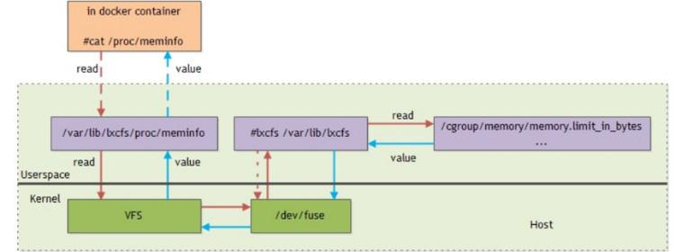

# [LXCFS](https://github.com/lxc/lxcfs)

## 解决的问题

Linuxs 利用 Cgroup 实现对容器的资源限制，但在容器内部缺省挂载宿主机上的**`procfs`的 `/proc`目录**，包含如：`meminfo,cpuinfo,stat,uptime`等资源信息。

- 一些监控工具如 `free/top`或遗留应用依赖上述文件内容获取资源配置和使用情况。当它们在容器中运行时，会**读取宿主机的资源状态**，引起错误。

社区中常见的做法是利用 lxcfs来提供**容器中的资源可见性**。lxcfs 是一个**开源的FUSE（用户态文件系统）**实现来支持LXC容器，它也可以支持Docker容器。

## 功能

LXCFS 通过用户态文件系统，在容器中提供下列 `procfs` 的文件。

```shell
/proc/cpuinfo
/proc/diskstats
/proc/meminfo
/proc/stat
/proc/swaps
/proc/uptime
```

把宿主机的 `/var/lib/lxcfs/proc/memoinfo` 文件挂载到Docker容器的 `/proc/meminfo`位置后。容器中进程读取相应文件内容时，LXCFS的FUSE实现会从容器对应的Cgroup中读取正确的内存限制。



## 使用

### 安装和测试

安装 lxcfs

```shell
$ wget https://copr-be.cloud.fedoraproject.org/results/ganto/lxd/epel-7-x86_64/00486278-lxcfs/lxcfs-2.0.5-3.el7.centos.x86_64.rpm
$ yum install lxcfs-2.0.5-3.el7.centos.x86_64.rpm  
```

启动 lxcfs

```shell
$ lxcfs /var/lib/lxcfs &  
```

测试

```shell
$ docker run -it -m 256m \
      -v /var/lib/lxcfs/proc/cpuinfo:/proc/cpuinfo:rw \
      -v /var/lib/lxcfs/proc/diskstats:/proc/diskstats:rw \
      -v /var/lib/lxcfs/proc/meminfo:/proc/meminfo:rw \
      -v /var/lib/lxcfs/proc/stat:/proc/stat:rw \
      -v /var/lib/lxcfs/proc/swaps:/proc/swaps:rw \
      -v /var/lib/lxcfs/proc/uptime:/proc/uptime:rw \
      ubuntu:16.04 /bin/bash
    
$ free
              total        used        free      shared  buff/cache   available
Mem:         262144         708      261436        2364           0      261436
Swap:             0           0           0
```

### K8s适配

在集群节点上安装并启动lxcfs，利用 Webhook 和 DaemonSet方式来运行 lxcfs FUSE文件系统。

- 参考：[denverdino/lxcfs-admission-webhook](https://github.com/denverdino/lxcfs-admission-webhook)