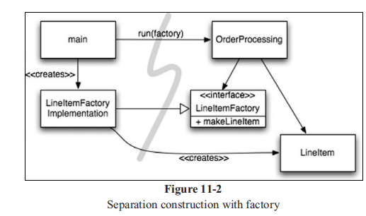

# **代码整洁之道**

> - **书籍：RobertC.Martin. [代码整洁之道[M]](https://www.alipan.com/s/mWGn6nA4rkK). 人民邮电出版社, 2010.**
>   - 第14-16章分别对代码做了重构的示例，这里不做展示。

## **1. 整洁代码**

> **什么是整洁代码：**
>
> - **（C++语言发明者，Bjarne Stroustrup）优雅和高效：代码逻辑直接了当，叫缺陷难以隐藏；尽量减少依赖关系；依赖某种分层战略完善错误处理代码；性能调制最优，省的引诱别人做没规矩的优化，搞出一堆混乱来。整洁的代码只做好一件事。**

- **代码永存**：代码是最终用来表达需求的语言；
- **混乱的代码**：断言烂程序总比什么没有强；
  - **回头清理**：稍后等于永不（Later equals never）
  
- **混乱的代价**：快速研发->效率低下->重新设计->快速研发，陷入循环；
  - 花时间保持代码整洁不但有关效率，还有关生存；
  - 制造混乱无助于赶上期限**，**唯一的做法是始终尽可能保持代码整洁**。**
  
- **专业态度**：项目经理从我们这里得到信息，才能作出承诺和保证；
  - 程序员遵从不了解混乱风险的经理的意愿，也是不专业的做法。
  - 经验与教训**：**病人请求医生做手术前别洗手，那样会花太多时间[^1]；

- **代码感：**从混乱中看出其他的可能与变化，贯彻技巧习得的“整洁感”；
  - 能分辨整洁代码和肮脏代码段，也不意味这会写整洁代码（示例：绘画）。

- **读写比例：**读写花费时间的比例超过10:1。写新代码时，一直在读旧代码；
  - 编辑器回放：记录每次击键动作，多数时间都在滚动屏幕和浏览其他模块。

- **童子军军规：让营地比你来时更干净；**

[^1]: 1847年当伊格纳兹·塞麦尔维斯（Ignaz Semmelweis）提出医生应洗手的建议时，遭到了反对，人们认为医生太忙，接诊时无暇洗手。

## **2. 有意义的命名**

- **名副其实**：体现本意的名称，不应该用注释来阐述变量的意义；
- **避免误导**：名称包含的类型（如List）跟实际不一致，提放使用不同之处较小的名称（如只有中间个别字符的变化）；
- **做有意义的区分**：错误示例如`Product`、`ProductInfo`、`ProductData`；
- **可读性强**：`genymddhms`（生成日期） => `generationTimeStamp`；
- **可搜索性强**：长名称胜于短名称(标志性，不重复)，名称长短应与作用域大小相对应。
- **避免使用编码**：不要把类型和作用域编进名称里面
  - 不要类型编码（强类型语言），无需`m_`成员前缀（更好的IDE）···

- **类名**：名词或者名词短语，避免`Manager, Processor, Data, Info`这样的类名
- **方法名**：动词或者动词短语，JavaBean规范（`get`,`set`）；
  - **重载构造器时，提供描述参数的静态工厂方法名（同时构造函数私有化）。**

- **一以贯之：每个抽象概念对应一个词，同名词保持使用同一个**
  - 如 `fetch, get, retrieve`，`controller,manager,driver`

- **解决方案领域名称优先：尽管使用CS术语、算法、模式名，只有程序员才会阅读代码**
  - 其次，才是使用问题领域的名称，至少维护者可以问领域专家。

- **合适的语境：良好命名的类、函数或名空间来放置名称，提供语境，最差是提供语境前缀。**
  - 添加语境：多个变量相关联，可以放到一个类中（组成关系）
  - 无用语境：对类使用包的前缀，如给每个类中添加GSD前缀

## **3. 函数**

> **如何写出这样的函数：没有人能够一开始就按照规则写函数**  
>
> - **先写：冗长而复杂，不满足要求；**
> - **测试：配上一套单元测试，覆盖每行丑陋的代码；**
> - **打磨：分解函数、修改名称、消除重复，保证测试通过。**

- **短小：**函数的缩进不该多于一层或者两层**。**
- **只做一件事：**函数中的代码应该处于同一抽象层上**，**每个函数一个抽象层级
- 可以使用 TO 起头段落来描述函数，自顶向下的 TO起头段落
- **Switch语句**：确保switch埋藏在较低的抽象层级，并永不重复。
  - **利用多态实现：switch 语句埋在抽象工厂底下。**
- **函数参数**：参数尽量可能少，尽量避免输出参数
  - 不要传入标识参数：函数不止干一件事
  - 三个以上参数时，需要将部分参数（有所关联）封装成类
  - 可变参数等价于类型为 List 的单个参数；
-  **无副作用**：函数尽量无副作用，否则函数名应该标识具备副作用
- **分隔指令与询问**：函数应该修改某对象的状态或者返回该对象的有关信息
  - 并发程序，需要保证`check-then-set`原子性，可以违反该原则
- **异常替代返回码：**错误处理代码，能从主路径代码中分离出来
  - 抽离`Try-Catch`代码块：错误处理就是一件事，单独的函数处理
  - 开闭原则：新的异常可以派生出来，无需重新编译或者重新部署

## **4. 注释**

> **别给糟糕的代码加注释——重新写吧。            ——Brian W.Kernighan 与 P.J.Plaugher**

- **注释不能美化糟糕的代码**：重构代码，提供可解释的名称而不是注释；
- **必要的注释**：
  - 法律信息（如开源协议），正则的解释和示例，无法修改的代码（如三方库）
  - 对意图的解释：某个决定后面的意图（阐述为什么要做这么做）
  - 警示：防止别人误用或者优化（如线程安全要求`SimpleDataFormat`非静态）
  - TODO注释：合理使用，定期查看，删除不再需要的
  - 公共API的 Javadoc：要保持跟代码的一致性
- **坏注释**：大多数注释都属于此类，是糟糕的代码的支撑或接口。
  - 多余的注释：不能提供比代码本身更多的信息（如只是对名称的叙述）。
  - 日志式注释：使用源码管理系统（包括作者、注释掉的代码等）。
  - 非本地信息：别在本地注释的上下文环境给出系统级的信息（同步困难）。
  - 废弃的注释：包括注释的代码；

## **5. 格式**

- **垂直尺寸**：用**大多数200行**，最长500行的单个文件，构建出色的系统；
  - 空白行：对不同的逻辑区块进行分离；
  - 关系密切的概念应该互相靠近；
  - 自上而下展示函数调用依赖顺序；
- **横向格式**：一般不超过80字符，**上限为 120 字符**；
- **团队规则**：定义**统一的规范**，并通过 IDE/编译脚本等强制执行。

## **6. 对象和数据结构**

> - **对象暴露行为，隐藏数据；**
>   - **添加新的对象类型时，无需修改既有行为；但难以在既有对象中添加新行为；**
>
> - **数据结构暴露数据，没有明显的行为；**
>   - **便于向既有数据结构添加新行为，但难以向既有函数添加新的数据结构；**

- **隐藏实现关乎抽象**：隐藏实现并非只是在变量之间放上一个函数层那么简单；
  - 暴露抽象接口，以便用户无需了解数据结构的实现就能操作数据本体；
  - 以抽象形态表述数据，而不是用接口和/或赋值器、取值器就万事大吉。
- **数据、对象的反对称性**：过程式代码难以添加新的数据结构（必须修改所有函数），面向对象代码难以添加新函数（必须修改所有类）。
- **Demeter 律**：模块不应了解它所操作对象的内部情形，避免过多的链式调用，尽量减少模块之间的依赖关系
  - 类 C 的方法 `f`之应该调用以下对象的方法（不应该嗲用由任何函数返回的对象的方法）：
    - `C`、`C`的成员对象、`f`创建的对象、`f`的参数对象
  - 对象应该隐藏其内部结构（getter/setter），暴露行为（要做什么事）；
- **数据传输对象**：DTO（Data Transfer Object），即 `bean`结构，只拥有数据，没有行为。
  - 不要创建数据结构和对象的混合体。

## **7. 错误处理**

- **使用异常而不是返回码**：将异常处理逻辑，与业务逻辑分离；
- **先写Try-Catch-Finally语句**：测试驱动，满足测试要求；
- **使用不可控异常**：可控异常违反开闭原则，在中间的每个方法都要声明该异常；
- **给出异常发生的环境说明**：创建信息充分的错误消息，包括失败的操作和失败类型等；
- **自定义异常类**：如对第三方API进行打包，捕获异常并返回自定义异常，避免耦合；
- **定义常规流程**：特例模式，用于异常时需要处理特殊情况；
  - 创建类或配置对象来处理特例，调用者不需要应付异常行为。
- **别返回NULL值**：抛出异常，或者返回特例对象（如空集合）
- **别传递NULL值**：避免空指针处理，能够明确参数列表传递 NULL 值意味着出问题；

## **8. 边界**

> **边界上的代码清晰的分割和定义了期望的测试，并且可以切换第三方的实现。**

- **使用第三方代码**：
  - 不要将`Map`（或在边界上的其他接口）在系统中传递，将其保留在类中。
- **学习性测试**：通过测试用例，理解第三方代码库的用法，保证其兼容性
- **使用尚不存在的代码**：还未开发完成的未知边界
  - 假定接口形式，以及使用适配器适配最终的边界接口；

## **9. 单元测试**

> **测试代码和生产代码一样重要，单元测试使得代码可扩展、可维护和可复用。**

- **TDD三定律**：
  - 定律一：在编写不能通过的单元测试前，不可编写生产代码；
  - 定律二：只可编写刚好无法通过的单元测试，不能编译也算不通过；
  - 定律三：只可编写刚好足以通过当前失败测试的生产代码；
- **保持测试整洁**：测试代码必须随着生产代码的演进而修改
  - 测试代码越脏，越难以修改，导致移除测试代码，最终生产代码不稳定；
- **整洁的测试代码**：可读性要强（细节要少）
  - 呈现构造-操作-检验（BUILD-OPERATE-CHECK）模式
- **每个测试一个概念**：尽可能减少每个概念的断言数量，每个测试函数只测试一个概念。
- **F.I.R.S.T：测试遵循的规则**
  - Fast：运行要快
  - Independent：互相独立
  - Repeatable：可重复运行
  - Self-Validating：布尔值输出
  - Timely（及时）：及时编写，在写生产代码前编写，保证可测试。

## **10. 类**

- **类的组织**：静态变量、变量、静态函数、公共函数、私有函数
  - 测试所使用：可以使用包私有变量，或者 protected；
- **类应该短小**：类的名称应该描述其权责
  - 如果无法为某个类命以精确的名称，则这个类大概就太长；
  - 如果类名中包括含义模糊的词，如 Processor或Manager或Super，则存在权责聚集的情况。
- **单一职责原则**：类应该且有一个加以修改的原因
  - 归置工具示例：许多抽屉且每个抽屉具有良好的定义和标记，而不是少数几个随便把所有东西扔进去的抽屉。
- **内聚**：保持内聚会得到许多短小的类；
  - 将大函数拆为小函数，往往也是将类拆分为许多小类的时机；
- **为了修改而组织**：对类加以组织，降低修改的风险
  - 出现只与类的一小部分有关的私有方法行为，意味着存在改进空间；
  - 依赖倒置原则：类应该依赖于抽象接口而不是具体细节，降低细节改动的影响。
- **不掩蔽时序耦合**：针对有调用顺序依赖的函数，通过第一个函数的返回参数是第二个函数的输入参数，强调时序性的耦合，变得可见。

## **11. 系统**

> 无论是设计系统或单独的模块，别忘了使用**大概可工作的最简单的方案**。

- **将系统的构造和使用分开：  将启始过程和启始过程后的运行时逻辑分开；**

  - **分解main**：将全部构造搬迁到 main 或者被称之为 main 的模块中；
  - **工厂**：应用程序负责确定何时创建对象，使用工厂类；

  

  - **依赖注入**：控制反转，分离构造与使用。

- **面向方面编程**：切分关注面，容易扩容（**Scaling Up**）

  - Java 代理：JDK的动态代理只能代理接口，字节码操作如CGLIB、ASM等可以代理类；

  - 纯 Java AOP 框架：Spring AOP， Google Guice；

  - AspectJ 的功能更强大；

- **测试驱动系统架构**：模块化和关注面的切分。在巨大的系统中，没人能做所有决策。

## **12. 迭进**

> 测试消除了对清理代码就会破坏代码的恐惧。

- **通过迭进设计达到整洁目的**：Kent Back 关于**简单设计**的四条规则
  - **运行所有测试**：紧耦合的代码难以编写测试。编写测试引致更好的设计；
  - **不可重复**：模板方法模式等可以用于移除重复代码；
  - **表达程序员的意图**：代码应清晰表达作者的意图（好的命名，短小的类和尺寸）；
  - **尽可能减少类和方法的数量**：避免太多的细小类和方法，较以上三点**优先级最低**。

## **13. 并发编程**

- 并发防御原则：
  - **单一权责原则**：并发设计自身足够复杂到成为修改的理由，**分离并发相关代码与其他代码**；
  - **限制数据作用域**：严格限制对可能被共享的数据的访问；
  - **使用数据副本**：复制对象以只读的方法使用，线程同步开销可以补偿创建对象的开销；
  - **线程尽可能独立**：尝试将数据分解到可被独立线程操作的独立子集；
- **警惕同步方法之间的依赖**：避免使用一个共享对象的多个方法，如`getThenSet, checkThenSet`；
  - 基于客户端的锁定：调用多个方法前，先对服务端加锁；
  - 基于服务端的锁定：服务端内创建锁定服务端的方法，调用所有方法，然后释放锁；
  - 适配服务端：创建执行锁定的中间层，不修改原始服务端的代码。
- **保持同步区微小**：尽可能减小同步区域，避免资源争用和提升执行效率；
- **编写正确的关闭代码**：编写一段**时间后平静地关闭**的系统，尽早考虑关闭问题，尽早令其工作正常。
- **测试线程代码**：编写有潜力暴露问题的测试
  - 不要将系统错误归咎于偶发事件；
  - 先使非线程代码可工作：不要同时追踪非线程缺陷和线程缺陷；
  - 编写可插拔的现成代码：可以在不同的配置环境下运行；
  - 编写可调整的线程代码：允许线程数量可调整；
  - 运行多于处理器数据量的线程：任务交换越频繁，越有可能使得错误代码出错；
  - 装置试错代码：添加线程调度等代码，改变执行顺序，增加出错几率
    - 硬编码：手动加入`wait()、sleep()、yield()、priority()`等调用；
    - 自动化：C++ 可以使用宏定义，对方法每条语句定义宏，测试时开启并编译该宏定义；

## **17. 味道与启发**

