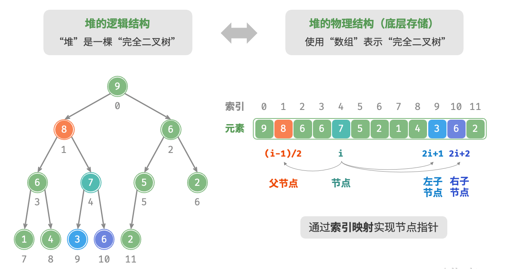

# 数组

> 所有代码实现见 [Java数据结构与算法](https://gitee.com/oscsc/data-structure-and-algorithm#%E6%95%B0%E7%BB%84)

## 堆

堆是个**完全二叉树**，因此底层可以用数组来表示。最小堆：

- 插入时，放到最后面，然后与父节点比较对调，直到 >= 父节点；
- 删除时，将最后一个元素放到一个元素（最后置为NULL），与子节点比较对调，直至 <= 子节点；




## 并查集

> 假设元素间有关联，且存在传递关系，如何快速判断两个元素是否有关联。

**用途**

1、维护无向图的连通性。支持判断两个点是否在同一连通块内；
2、判断增加一条边是否会产生环：用在求解最小生成树的Kruskal算法里；

**定义**：管理一系列**不相交的集合**，只支持两种操作：

- **合并**（Union）：把两个不相交的集合合并为一个集合。
- **查询**（Find）：查询两个元素是否在同一个集合中。

**初始版本**（合并复杂度/查询复杂度：O(h)，h表示树的高度，最差为链表）

算法过程：每个元素只知道自己的父节点；

- 初始每个元素父节点即自身或者 -1，`ids[i] = i`；

- 查找元素所属的集合

  ```c
  int find(i) {
      while (ids[i] != i) {
          i = ids[i];
      }
      return i;
  }
  ```

- 合并两个元素时，将其中一个节点的集合指向另一个节点，`ids[find(i)]=j`；

- 判断两个是否处于同一个集合，`find(i)==find(j)`；

**路径压缩**

- 解决查找时次数过多的问题，防止树变成链表，查找复杂度变为O(n)；
- 查找时将x到根节点路径上的所有点的`parent`设为根节点，该优化方法称为压缩路径

**按秩合并**

- 维护每个子树的节点个数，合并时将小的子树合并到大的子树上
- 如果是维护子树的高度，则路径压缩会造成rank不准确，因此按照 size 进行合并；


## 树状数组

树状数组（**B**inary **I**ndex **T**ree, **BIT**），最简单的树状数组支持两种操作，时间复杂度均为 Olg(n)：

- **单点修改**：更改数组中一个元素的值
- **区间查询**：查询一个区间内所有元素的和

对于普通数组而言，**单点修改**的时间复杂度是O(1)，但**区间求和**的复杂度是O(n)。

### 原理

树状数组的定义：

- 二进制数最右边的一个1，连带着它之后的0为$lowbit(x)$，用$C(i)$维护区间$(A_i-lowbit(A_i), Ai]$，这样查询前n项和时需要合并的区间数是少于$log_2(n)$：


更新就是一个“**爬树**”的过程。一路往上更新，直到MAXN（树状数组的容量）。


$lowbit(x)=(x)\&(-x)$

