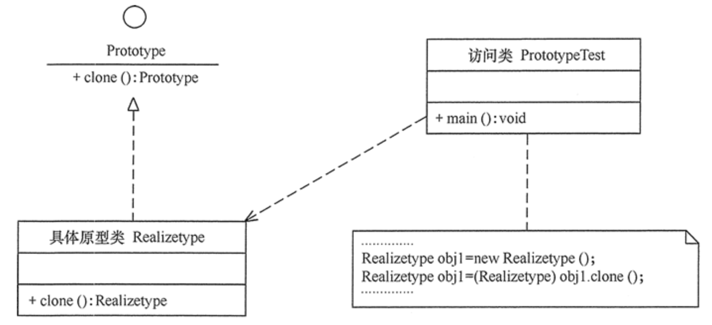

# 原型模式

## 意图

用一个已经创建的实例作为原型，通过复制该原型对象来创建一个和原型相同或相似的新对象。

- **当直接创建对象的代价比较大时，则采用这种模式。**

## 适用性

- 系统应独立于产品的创建、构成和表示。
- 需要在运行时指定实例化的类，例如通过动态加载。
- 避免创建与产品类层次平行的工厂类层次。
- 类的实例只能有几种不同状态组合，克隆原型比手工实例化更方便。

应用实例

- 细胞分裂
- Java 中的 `Object.clone()` 方法

## 类图

- 抽象原型类：规定了具体原型对象必须实现的接口。
- 具体原型类：实现抽象原型类的 clone() 方法，它是可被复制的对象。
- 访问类：使用具体原型类中的 clone() 方法来复制新的对象。

## 优缺点

优点

- 性能提高，避免构造函数的约束

缺点

- 配备克隆方法需要全面考虑类的功能，对已有类可能较难实现，特别是处理不支持串行化的间接对象或含有循环结构的引用时。
- 注意浅拷贝和深拷贝。