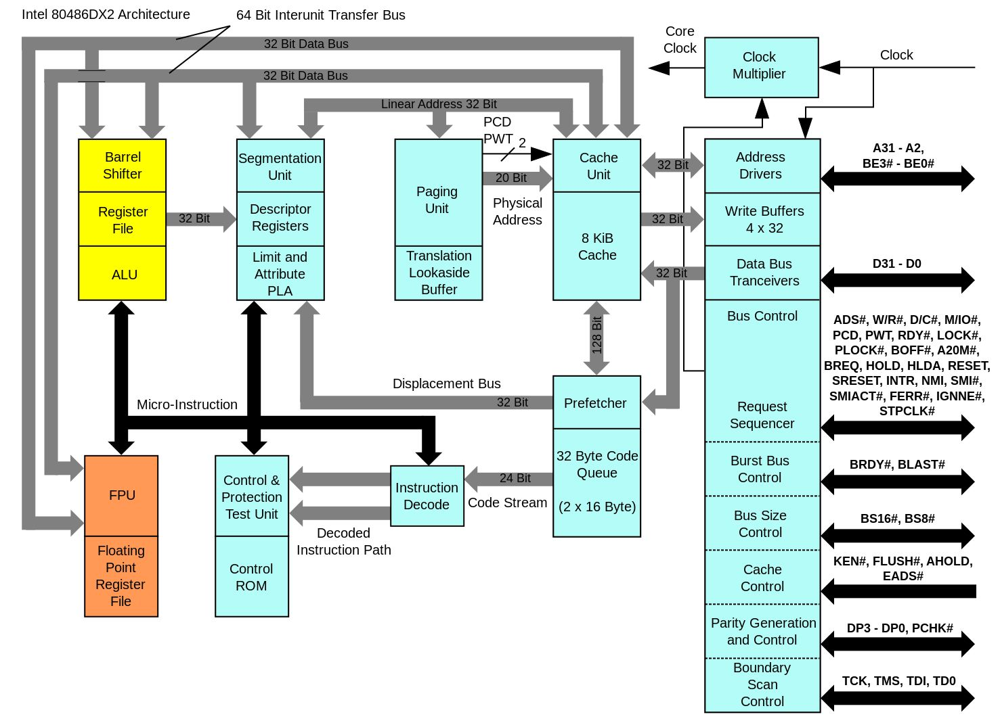

# 并发控制基础

**本讲内容**：并发编程困难不代表我们只能摆烂——我们还可以创造出新的手段，帮助我们编写正确的并发程序：

- 互斥问题和 Peterson 算法
- Peterson 算法的正确性和模型检验
- Peterson 算法在现代多处理器系统上的实现
- 实现并发控制的硬件和编译器机制


## 互斥问题

### 并发编程：从入门到放弃

人类是 sequential creature

- 编译优化 + weak memory model 导致难以理解的并发执行

- [Verifying sequential consistency 是 NP-完全问题](https://epubs.siam.org/doi/10.1137/S0097539794279614)

人类是 (不轻言放弃的) sequential creature

- 手段：<font color='red'>'“回退到” 顺序执行</font>
  - 标记若干块代码，使得这些代码一定能按某个顺序执行

### 回退到顺序执行：互斥

插入 “神秘代码”，使得所有其他 “神秘代码” 都不能并发

- 由 “神秘代码” 领导不会并发的代码 (例如 pure functions) 执行

  ```c
  void Tsum() {
    stop_the_world();
    // 临界区 critical section
    sum++;
    resume_the_world();
  }
  ```

Stop the world 真的是可能的

- Java 有 “stop the world GC”
- 单个处理器可以关闭中断
- 多个处理器也可以发送核间中断

### 确定假设、设计算法

失败的尝试：**并发程序不能保证 load + store 的原子性**

```c
int locked = UNLOCK;
void critical_section() {
retry:
  if (locked != UNLOCK) {
    goto retry;
  }
  locked = LOCK;

  // critical section

  locked = UNLOCK;
}
```

假设：内存的读/写可以保证顺序、原子完成

- `val = atomic_load(ptr)`
  - 看一眼某个地方的字条 (只能看到瞬间的字)
  - 刚看完就可能被改掉
- `atomic_store(ptr, val)`
  - 对应往某个地方 “贴一张纸条” (必须闭眼盲贴)
  - 贴完一瞬间就可能被别人覆盖

对应于`model checker`

- 每一行可以执行一次全局变量读或写（原子性）；
- 每个操作执行之后都发生 `sys_sched()`；

### Peterson 算法（如何证明正确）

> 证明 Peterson 算法正确，或给出反例。

形象化示例：A 和 B 争用厕所的包厢

- 想进入包厢之前，A/B 都首**先举起自己的旗子**
  - A 往厕所门上贴上 “B 正在使用” 的标签
  - B 往厕所门上贴上 “A 正在使用” 的标签
- 然后，如果**对方举着旗，且门上的名字是对方，等待**
  - 否则可以进入包厢
- 出包厢后，放下自己的旗子 (完全不管门上的标签)

### 绕来绕去很容易有错漏

Prove by brute-force

- 枚举状态机的全部状态 ($PC_1，PC_2,x,y,turn$)
- 但手写还是很容易错啊——可执行的状态机模型有用了！

```c
void TA() { while (1) {
/* ❶ */  x = 1;
/* ❷ */  turn = B;
/* ❸ */  while (y && turn == B) ;
/* ❹ */  x = 0; } }

void TB() { while (1) {
/* ① */  y = 1;
/* ② */  turn = A;
/* ③ */  while (x && turn == A) ;
/* ④ */  y = 0; } }
```

## 模型、模型检验与现实

### Model Checker 和自动化

可以帮助我们快速回答更多问题

- 如果结束后把门上的字条撕掉，算法还正确吗？
  - 在放下旗子之前撕
  - 在放下旗子之后撕
- 如果先贴标签再举旗，算法还正确吗？
- 我们有两个 “查看” 的操作
  - 看对方的旗有没有举起来
  - 看门上的贴纸是不是自己
  - 这两个操作的顺序影响算法的正确性吗？
- 是否存在 “两个人谁都无法进入临界区” (liveness)、“对某一方不公平” (fairness) 等行为？
  - 都转换成**图 (状态空间) 上的遍历问题**了！

### 从模型回到现实……

回到假设 (体现在模型)

- Atomic load & store：假设在现代多处理器上并不成立
- <font color='red'>所以实际上按照模型直接写 Peterson 算法应该是错的？</font>

“实现正确的 Peterson 算法” 是合理需求，它一定能实现

- `Compiler barrier/volatile` 保证不被优化的前提下
  - 处理器提供特殊指令保证可见性
  - 编译器提供 `__sync_synchronize()` 函数
    - x86: `mfence`; ARM: `dmb ish`; RISC-V: `fence rw, rw`
    - 同时**含有一个 compiler barrier**

## 原子指令  

### 并发编程困难的解决

普通的变量读写在编译器 + 处理器的双重优化下行为变得复杂

```c
retry:
  if (locked != UNLOCK) {
    goto retry;
  }
  locked = LOCK;
```

解决方法：编译器和硬件共同提供<font color='red'>不可优化、不可打断</font>的指令

- **“原子指令” + compiler barrier**

### 实现正确的求和

```c
for (int i = 0; i < N; i++)
  asm volatile("lock incq %0" : "+m"(sum));
```

“Bus lock”——从 80386 开始引入 (bus control signal)



### 编译器和硬件的协作

Acquire/release semantics

- 对于一对配对的 release-acquire
  - (逻辑上) release 之前的 store 都对 acquire 之后的 load 可见
  - [Making Sense of Acquire-Release Semantics](https://davekilian.com/acquire-release.html)

- `std::atomic`
  - `std::memory_order_acquire`: guarantees that **subsequent loads** are not moved before the current load or any preceding loads.
  - `std::memory_order_release`: **preceding stores** are not moved past the current store or any subsequent stores.
  - `x.load()`/`x.store()` 会根据 [memory order](https://en.cppreference.com/w/cpp/atomic/memory_order) 插入 fence
  - `x.fetch_add()`将会保证 cst (sequentially consistent)
    - 去 [godbolt](https://godbolt.org/) 上试一下吧（翻译成对应的指令）
