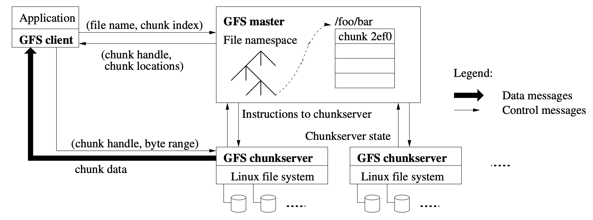

# 并发控制：同步 (2)

> 信号量是一种特殊的条件变量，而且可以在操作系统上被高效地实现，**避免 broadcast 唤醒的浪费**。
>
> 但凡能将任务很好地分解成**少量串行的部分和绝大部分 “线程局部” 的计算**，那么**生产者-消费者和计算图模型**就能实现有效的并行。

**本讲内容**：另一种共享内存系统中常用的同步方法：信号量 (E. W. Dijkstra)

- 什么是信号量
- 信号量适合解决什么问题
- 哲学家吃饭问题

## 信号量

### 信号量：一种条件变量的特例

```c
void P(sem_t *sem) { // wait
  wait_until(sem->count > 0) {
    sem->count--;
  }
}

void V(sem_t *sem) { // post (signal)
  atomic {
    sem->count++;
  }
}
```

正是因为条件的特殊性，**信号量不需要 broadcast**

- P 失败时立即睡眠等待
- 执行 V 时，唤醒任意等待的线程

### 理解信号量

信号量对应了 “资源数量”

- 互斥锁是信号量的特例
- 扩展的互斥锁：一个手环 → *n* 个手环（游泳池的示例）

### 信号量：实现优雅的生产者-消费者

信号量设计的重点

- 考虑 “球”/“手环” (每一单位的 “<font color='red'>资源</font>”) 是什么
- 生产者/消费者 = 把球从一个袋子里放到另一个袋子里：**两种资源**

```c
// emtpy = full, fill = 0；表示开始队列中开始没有资源
void Tproduce() {
  P(&empty);
  printf("("); // 注意共享数据结构访问需互斥
  V(&fill);
}
void Tconsume() {
  P(&fill);
  printf(")");
  V(&empty);
}
```


## 信号量：应用

### 信号量的两种典型应用

1. 实现**一次临时的 happens-before**：假设 s 只被使用一次，保证 A happens-before B
   - 初始：s = 0
   - A; V(s)
   - P(s); B

2. 实现**计数型的同步**：如线程库的 join

   - 初始：done = 0

   - Tworker: V(done)

   - Tmain: P(done) ×*T*

### 例子：实现计算图

对于任何计算图：为每个节点分配一个线程

- 对每条入边执行 P (wait) 操作
- 完成计算任务
- 对每条出边执行 V (post/signal) 操作
  - 每条边恰好 P 一次、V 一次
  - [M2 Lab PLCS](./M2_plcs.md) 直接就解决了啊？

```c
void Tworker_d() {
  P(bd); P(ad); P(cd);
  // 完成节点 d 上的计算任务
  V(de);
}
```


存在的问题：

- 创建那么多线程和那么多信号量 = Time Limit Exceeded
- 解决线程太多的问题：**一个线程负责多个节点的计算**
  - 静态划分 → 覆盖问题
  - 动态调度 → 又变回了生产者-消费者
- 解决信号量太多的问题：**计算节点共享信号量**
  - 可能出现 “假唤醒” → 又变回了条件变量

### 练习题的信号量实现

有三种线程

- Ta 若干: 死循环打印 `<`
- Tb 若干: 死循环打印 `>`
- Tc 若干: 死循环打印 `_`
- 如何同步这些线程，保证打印出 `<><_` 和 `><>_` 的序列？

信号量的困难

- 上一条鱼打印后，`<` 和 `>` 都是可行的
- 我应该 P 哪个信号量？
  - 可以 P 我自己的
  - 由打印 `_` 的线程随机选一个

### 使用信号量实现条件变量：本质困难

操作系统用**自旋锁保证 wait 的原子性**

```c
wait(cv, mutex) {
  release(mutex);
  sleep();
}
```

[信号量实现的矛盾](http://birrell.org/andrew/papers/ImplementingCVs.pdf)

- 不能带着锁睡眠：死锁
- 也不能先释放锁
  - `P(mutex); nwait++; V(mutex);`
  - 此时 signal/broadcast 发生，唤醒了后 wait 的线程
  - `P(sleep);`

### 信号量：小结

信号量是对 “袋子和球/手环” 的抽象

- 实现一次 happens-before，或是计数型的同步
  - 能够写出优雅的代码
  - `P(empty); printf("("); V(fill)`
- <font color='red'>但并不是所有的**同步条件**都容易用这个抽象来表达</font>


## 哲学家吃饭问题

经典同步问题：哲学家 (线程) 有时思考，有时吃饭 (E. W. Dijkstra, 1960)

- 吃饭需要同时得到左手和右手的叉子
- 当叉子被其他人占有时，必须等待，如何完成同步？

### 成功的尝试 (万能的方法)

```c
#define CAN_EAT (avail[lhs] && avail[rhs])

mutex_lock(&mutex);
while (!CAN_EAT)
  cond_wait(&cv, &mutex);
// 拿叉子
avail[lhs] = avail[rhs] = false;
mutex_unlock(&mutex);

// 吃饭
print("eat");

mutex_lock(&mutex);
// 释放叉子，唤醒等待叉子的线程
avail[lhs] = avail[rhs] = true;
cond_broadcast(&cv);
mutex_unlock(&mutex);
```

### 信号量的实现

**失败的尝试：死锁**

- 把信号量当互斥锁：先拿一把叉子，再拿另一把叉子

Trick: 死锁会在 5 个哲学家 “同时吃饭” 时发生 ---- 破坏死锁条件

- 保证任何时候至多只有 4 个人可以吃饭：**4个资源的信号量**
- 直观理解：大家先从桌上退出，袋子里有 4 张卡，拿到卡的可以上桌吃饭 (拿叉子)吃完以后把卡归还到袋子

### 反思：分布与集中

“Leader/follower” - 有一个集中的 “总控”，而非 “各自协调”

- 在**可靠的消息机制上实现任务分派**
  - **Leader 串行处理所有请求** (例如：条件变量服务)

```c
void Tphilosopher(int id) {
  send(Twaiter, id, EAT);
  receive(Twatier); // 等待 waiter 把两把叉子递给哲学家
  eat();
  send(Twaiter, id, DONE); // 归还叉子
}

void Twaiter() {
  while (1) {
    (id, status) = receive(Any);
    switch (status) { ... }
  }
}
```

你可能会觉得，管叉子的人是性能瓶颈

- Premature optimization is the root of all evil (D. E. Knuth)

<font color='red'>抛开 workload 谈优化就是耍流氓</font>

- 吃饭的时间通常远远大于请求服务员的时间
- 如果一个 manager 搞不定，可以分多个 (fast/slow path)
  - 把系统设计好，集中管理可以不是瓶颈：[The Google File System](https://pdos.csail.mit.edu/6.824/papers/gfs.pdf) (SOSP'03) 开启大数据时代



## 课后习题/编程作业

### 1. 阅读材料

教科书 Operating Systems: Three Easy Pieces:

- [第 31 章 - Semaphores](./book_os_three_pieces/31-threads-sema.pdf)

### 2. 编程实践

运行示例代码并观察执行结果。建议大家先不参照参考书，通过两个信号量分别代表 Tproduce 和 Tconsume 的唤醒条件实现同步。