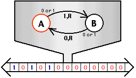

# 多处理器系统与中断机制

**本讲内容**：操作系统内核实现

- 多处理器和中断
- AbstractMachine API
- 50 行实现嵌入式操作系统

为什么 `while (1)` 不会把操作系统 “卡死”：

- 在操作系统代码切换到应用程序执行时，**操作系统内核会打开中断**
- “不可信任” 的应用程序定期会收到时钟中断被打断，且应用程序无权配置中断
- 操作系统接管中断后，可以切换到另一个程序执行

## 多处理器上的操作系统内核

### AbstractMachine: TRM

Turing Machine: 一个处理器，一个地址空间

- “无情的执行指令的机器” (rvemu) 的抽象
- 可用的内存是静态变量和 `heap`
- 只能执行计算指令和 putch, halt



### AbstractMachine: MPE

Multiprocessing Extension: 多个处理器，一个地址空间

- 可用的地址空间依然是静态变量和 `heap` (处理器间共享)
- “多个 Turing Machine，共享一个纸带”

状态机模型发生了改变

- 状态：共享内存和每个处理器的内部状态

  ​														$(M,R_1,R_2,…,R_n)$

- 状态迁移：处理器 *t *分隔出一个 “单处理器计算机”

  - 执行$(M,R_t)→(M^′,R_t^′)$

    ​												v$(M,R_1,R_2,…,R_n)→(M^′,R_1,R_2,…,R_t^′,…,R_n)$

### 简易多处理器内核 (L1 的模型)

与多线程程序完全一致

- 同步仅能通过原子指令如 `xchg` 实现

```c
uint8_t shm[MEM_SIZE]; // Shared memory

void Tprocessor() {
  struct cpu_state s;
  while (1) {
    fetch_decode_exec(&s, shm);
  }
}

int main() {
  for (int i = 0; i < NPROC; i++) {
    create(Tprocessor);
  }
}
```


## 中断机制

### 理解中断

硬件上的中断：一根线

- $\overline{IRQ}, \overline{NMI}$（边沿触发，低电平有效）：IRQ（中断要求），NMI（不可屏蔽中断）
- “告诉处理器：停停，有事来了”
  - 剩下的行为交给处理器处理

实际的处理器并不是 “无情地执行指令”

- 无情的执行指令
- 同时有情地响应外部的打断


### 处理器的中断行为

“响应”

- 首先检查处理器配置是否允许中断
  - 如果处理器关闭中断，则忽略
- x86 Family
  - 询问中断控制器获得中断号 n
  - 保存 CS, RIP, RFLAGS, SS, RSP 到堆栈
  - 跳转到 `IDT[n]` 指定的地址，并设置处理器状态 (例如关闭中断)
- RISC-V (M-Mode)
  - 检查 mie 是否屏蔽此次中断
  - 跳转 `PC = (mtvec & ~0xf)`
  - 更新 `mcause.Interrupt = 1`

### RISC-V M-Mode 中断行为 RTFSC

“更多的处理器内部状态”

- TFM [Volume II: Privileged Architecture](https://riscv.org/wp-content/uploads/2019/08/riscv-privileged-20190608-1.pdf)

```c
struct MiniRV32IMAState {
  uint32_t regs[32], pc;
  uint32_t mstatus;
  uint32_t cyclel, cycleh;
  uint32_t timerl, timerh, timermatchl, timermatchh;
  uint32_t mscratch, mtvec, mie, mip;
  uint32_t mepc, mtval, mcause;
  // Note: only a few bits are used.  (Machine = 3, User = 0)
  // Bits 0..1 = privilege.
  // Bit 2 = WFI (Wait for interrupt)
  // Bit 3+ = Load/Store reservation LSBs.
  uint32_t extraflags;
};
```

### 中断：奠定操作系统 “霸主地位” 的机制

**操作系统内核 (代码)：想开就开，想关就关**

**应用程序：对不起，没有中断**（死循环也可以被打断）

- 在 gdb 里可以看到 flags 寄存器 (`FL_IF`)
- CLI — [Clear Interrupt Flag](https://www.felixcloutier.com/x86/cli)
  - `#GP(0)` If CPL is greater than IOPL and less than 3
  - 试一试 `asm volatile ("cli");`：segment fault；

### AbstractMachine 中断 API

隔离出一块 “处理事件” 的代码执行时空

- 执行完后，可以返回到被中断的代码继续执行

```c
bool cte_init(Context *(*handler)(Event ev, Context *ctx)); // interrupt handler
bool ienabled(void);  // interrupt enabled or not
void iset(bool enable);  // set interrupt
```

中断引入了并发

- **最早操作系统的并发性就是来自于中断 (而不是多处理器)**
- 关闭中断就能实现互斥
  - 系统中只有一个处理器，永远不会被打断
  - 关中断实现了 “stop the world”

### 真正的计算机系统模型

状态：共享内存和每个处理器的内部状态$(M,R_1,R_2,…,R_n)$

状态迁移

1. 处理器 *t* 执行一步$ (M,R_t)→(M^′,R_t^′)$
   - 新状态为 $(M^′,R_1,R_2,…,R_t′,…,R_n)$
2. 处理器 *t* 响应中断

假设 race-freedom

- 不会发生 relaxed memory behavior
- 模型能触发的行为就是真实系统能触发的所有行为

### 例子：实现中断安全的自旋锁

> 内核中的线程并发。

实现原子性：

```c
printf("Hello\n");
```

- **printf 时可能发生中断**
- 多个处理器可能同时执行 printf

这件事没有大家想的简单

- **多处理器和中断是两个并发来源**

## 50 行实现操作系统内核

### 中断处理程序的秘密

参数和返回值 “Context”

```c
Context *handler(Event ev, Context *ctx) {
  ...
}
```

- 中断发生后，不能执行 “任何代码”
  - `movl $1, %rax` 先前状态机就被永久 “破坏” 了
  - 除非**把中断瞬间的处理器状态保存下来**
  - 中断返回时需要把寄存器恢复到处理器上
- 看看 Context 里有什么吧

### 实现多处理器多线程

AbstractMachine API

- 你只需要提供一个栈，就可以创建一个可运行的 context

```c
Context *on_interrupt(Event ev, Context *ctx) {
  if (!current) {
    current = &tasks[0];  // First trap for this CPU
  } else {
    current->context = ctx; // Keep the stack-saved context
  }

  // Schedule
  do {
    current = current->next;
  } while (!on_this_cpu(current));

  return current->context;
}
```