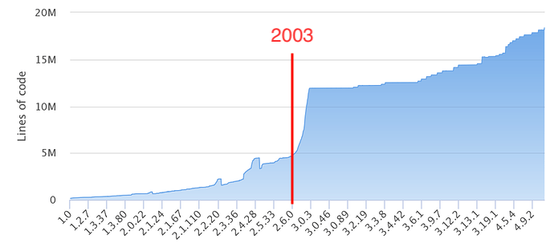

# Linux 操作系统

> 从 CPU Reset 后的 “硬件初始状态” 到操作系统加载完 init 进程后的 “软件初始状态”，从此以后，计算机系统中的一切都是由应用程序主导的，操作系统只是提供系统调用这一服务接口。

**本讲内容**：完整的应用世界到底是如何构建的？在这节课中，我们用一个 “最小” 的 Linux 系统解答这个问题：

- Linux 操作系统
- Linux 系统启动和 initramfs
- Linux 应用世界的构建

## Linux 历史

### 25 Aug 1991, The Birthday of Linux

> Hello, everybody out there using minix – I’m doing a (free) operating system (just a hobby, won’t be big and professional like gnu) for 386(486) AT clones. This has been brewing since April, and is starting to get ready.
>
> —— Linus Torvalds (时年 21 岁)

Linux 是基于宏内核，而 Minix 是基于微内核。

- [Tanenbaum/Linus "Linux is Obsolete" Debate](https://www.oreilly.com/openbook/opensources/book/appa.html)

### Minix

Minix: 完全用于教学的真实操作系统  by Andrew S. Tanenbaum

年轻人的第一个 “全功能” 操作系统

- Minix1(1987): UNIXv7 兼容
  - Linus 实现 Linux 的起点
- [Minix2](http://download.minix3.org/previous-versions/Intel-2.0.4/)(1997): POSIX 兼容
  - 更加完备的系统，书后附全部内核代码

- [Minix3](http://minix3.org/)(2006): POSIX/NetBSD 兼容
  - 一度是世界上应用最广的操作系统：Intel ME 人手一个

### Linux 代码行数



- Linux 2.0 引入多处理器 (Big Kernel Lock, 内核不能并行)
- Linux 2.4 内核并行
- 2002 年才引入 Read-Copy-Update (RCU) 无锁同步
- 2003 年 Linux 2.6 发布，随云计算开始起飞

## 构建最小 Linux 系统

### 启动 Linux

控制 Linux Kernel 加载的 “第一个状态机”？—— `rdinit`

挑战 ChatGPT：

- 我希望用 QEMU 在给定的 Linux 内核完成初始化后，直接执行我自己编写的、静态链接的 init 二进制文件。我应该怎么做？ 

熟悉的 QEMU，稍稍有些不熟悉的命令行选项

- 再次挑战 ChatGPT：如果我希望用 QEMU 启动我给定的 Linux 内核二进制文件 vmlinuz 和初始内存文件系统 initramfs，应该使用怎样的 QEMU 参数使得 initramfs 中的 /bin/hello 作为第一个执行的程序？

```shell
initramfs:
# Copy kernel and busybox from the host system
	@mkdir -p build/initramfs/bin
	sudo bash -c "cp /boot/vmlinuz build/ && chmod 666 build/vmlinuz"
	cp $(INIT) build/initramfs/
	cp $(shell which busybox) build/initramfs/bin/
run:
# Run QEMU with the installed kernel and generated initramfs
    qemu-system-x86_64 \
      -serial mon:stdio \
      -kernel build/vmlinuz \
      -initrd build/initramfs.cpio.gz \
      -machine accel=kvm:tcg \
      -append "console=ttyS0 quiet rdinit=$(INIT)"
```

### initrd

`initrd `(boot loader initialized RAM disk）只是一个内存里的小文件系统

内核启动被分成了两个阶段：

- 第一阶段先执行 initrd 文件系统中的"某个文件"（init 程序），完成加载驱动模块等任务
- 第二阶段才会执行真正的文件系统中的任务 /sbin/init 进程（实际是 `systemmd`，软链接）。
  - 包括加载剩余必要的驱动程序，例如网卡/显卡驱动；

### pivot_root

> `pivot_root()` changes **the root mount in the mount namespace of the calling process**. More precisely, it moves the root mount to the directory `put_old` and makes `new_root` the new root mount. The calling process must have the `CAP_SYS_ADMIN` capability in the user namespace that owns the caller's mount namespace.

```c
int pivot_root(const char *new_root, const char *put_old);
```

在 init 时多做一些事

```bash
export PATH=/bin
busybox mknod /dev/sda b 8 0
busybox mkdir -p /newroot
busybox mount -t ext2 /dev/sda /newroot
exec busybox switch_root /newroot/ /etc/init
```

- pivot_root 之后才加载网卡驱动、配置 IP
  - 这些都是 systemd 的工作 (你会留意到 tty 字体变了)
- 之后 initramfs 就功成身退，资源释放
