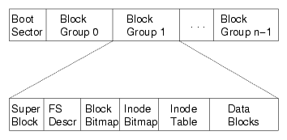

# FAT 和 UNIX 文件系统

**本讲内容**：

- 文件系统实现分析
- FAT 文件系统
- UNIX 文件系统

## 磁盘上的数据结构

### 文件系统实现

文件的实现

- 文件 = “虚拟” 磁盘
- `API: read, write, ftruncate, ...`

目录的实现

- 目录 = 文件/目录的集合
- `API: mkdir, rmdir, readdir, link, unlink, ...`

思考题：`mount` 如何实现？

- 最好由操作系统统一管理 (而不是由具体的文件系统实现)

### 如果是《数据结构》课？

借助 RAM (Random Access Memory) 自由布局目录和文件

- `FileSystem` 就是一个 `Abstract DataType (ADT)`
- `Memory Hierarchy` 在苦苦支撑 “random access” 的假象

```c++
class FSObject {
};

class File: FSObject {
  std::vector<char> content;
};

class Directory: FSObject {
  std::map<std::string,FSObject*> children;
};
```

- 实现上面的 API 完全就是个课后习题

### 回到《操作系统》课

没有 Random Access Memory

- 只有 <font color='red'>**block device**</font> 和两个 API（被迫读写连续的一块数据）
  - `bread(int bid, struct block *b);`
  - `bwrite(int bid, struct block *b);`

如果用 block device 模拟 RAM，就会出现**严重的读/写放大**

- 我们需要更适合磁盘的数据结构实现 `read`, `write`, `ftruncate`, ...

## File Allocation Table (FAT)

### 让时间回到 1980 年

5.25" 软盘：单面 180 KiB

- 360 个 512B 扇区 (sectors)
- 在这样的设备上实现文件系统，应该选用怎样的数据结构？


### 需求分析

相当小的文件系统

- 目录中一般只有**几个、十几个**文件
- 文件以**小文件**为主 (几个 block 以内)

文件的实现方式

- `struct block *`的链表
  - 任何复杂的高级数据结构都显得浪费

目录的实现方式

- 目录就是一个普通的文件 (虚拟磁盘；“<font color='red'>**目录文件**</font>”)
- 操作系统会对**文件的内容作为目录的解读**
  - 文件内容就是一个 `struct dentry[];`

### 用链表存储数据：两种设计

在**每个数据块后放置指针**

- **优点**：实现简单、无须单独开辟存储空间
- **缺点**：数据的大小不是 $2^k$; 单纯的 `lseek` 需要读整块数据

将**指针集中存放在文件系统的某个区域**

- **优点**：局部性好；lseek 更快
- **缺点**：集中存放的数据损坏将导致数据丢失

### 集中保存所有指针

集中存储的指针容易损坏？存*n* 份就行！

- FAT-12/16/32 (FAT entry，即 “next 指针” 的大小)


### FAT文件系统

[RTFM](./pdfs/MSFAT-spec.pdf) 得到必要的细节

- 诸如 tutorial、博客都不可靠，还会丢失很多重要的细节

```c
if (CountofClusters < 4085) {
  // Volume is FAT12 (2 MiB for 512B cluster)
} else if (CountofCluster < 65525) {
  // Volume is FAT16 (32 MiB for 512B cluster)
} else {
  // Volume is FAT32
}
```

### FAT: 链接存储的文件

“FAT” 的 “next” 数组

- `0`: free; `2...MAX`: allocated;
- `ffffff7`: bad cluster; `ffffff8-ffffffe`, `-1`: end-of-file


### 目录树实现：目录文件

以普通文件的方式存储 “目录” 这个数据结构

- FAT: 目录 = 32-byte 定长目录项的集合
- 操作系统在解析时把**标记为目录的目录项 “当做” 目录**即可
  - 可以用连续的若干个目录项存储 “长文件名”
- 思考题：为什么不把元数据 (大小、文件名、……) 保存在 `vector<struct block *> file` 的头部？

### Talk is Cheap, Show Me the Code!

首先，观察 “快速格式化” (`/usr/sbin/mkfs.fat`) 是如何工作的

- 老朋友：strace

然后，把整个磁盘镜像 mmap 进内存

- 照抄手册，遍历目录树 (fat-tree demo)，试试[镜像](https://box.nju.edu.cn/f/0764665b70a34599813c/?dl=1)

另一个有趣的问题：文件系统恢复

- **快速格式化 = FAT 表丢失**
  - 所有的文件内容 (包括目录文件) 都还在
  - 只是在数据结构眼里看起来都是 “free block”
- 首先需要猜出文件系统的参数 (`SecPerClus`, `BytsPerSec`, `FATSz32`, `BPB_RootClus`, ...)
- 本质上是 cluster 的分类和建立 “可能后继关系”

### FAT: 性能与可靠性

性能

- 优点：小文件简直太合适了
- 缺点：但**大文件的随机访问**就不行了
  - 4 GB 的文件跳到末尾 (4 KB cluster) 有 220220 次链表 next 操作
  - 缓存能部分解决这个问题
- 在 FAT 时代，磁盘连续访问性能更佳
  - 使用时间久的磁盘会产生碎片 (fragmentation)
  - malloc 也会产生碎片，不过对性能影响不太大

可靠性

- 维护**若干个 FAT 的副本**防止元数据损坏 (额外的开销)
- 损坏的 cluster 在 FAT 中标记


## ext2/UNIX 文件系统

### 更好的文件系统：需要做到什么？

不能 “尽善尽美”，但可以在 “实际 workload” 下尽可能好

| **Summary**                          | **Findings**                                      |
| :----------------------------------- | :------------------------------------------------ |
| Most files are small                 | Roughly 2K is the most common size                |
| Average file size is growing         | Almost 200K is the average                        |
| Most bytes are stored in large files | A few big files use most of the space             |
| File systems contains lots of files  | Almost 100K on average                            |
| File systems are roughly half full   | Even as disks grow, file systems remain ~50% full |
| Directories are typically small      | Many have few entries; most have 20 or fewer      |

### ext2/UNIX 文件系统

按**对象方式集中存储**文件/目录元数据

- 增强局部性 (更易于缓存)
- 支持链接

为**大小文件区分 fast/slow path**

- 小的时候应该用**数组**：连链表遍历都省了
- 大的时候应该用**树** (B-Tree; Radix-Tree; ...)：快速的随机访问

### ext2: 磁盘镜像格式

对磁盘进行分组



“superblock”：文件系统元数据

- 文件 (inode) 数量
- block group 信息
  - [ext2.h](https://jyywiki.cn/pages/OS/2023/p/ext2.h) 里有你需要知道的一切

### ext2 inode

- DIrect Blocks：直接块，数组；
- Indirect blocks：一级块索引；
- Double Indirect：二级块索引；


### ext2 目录文件

与 FAT 本质相同：在**文件上建立目录的数据结构**

- 注意到 **inode 统一存储**
  - 目录文件中存储文件名到 inode 编号的 key-value mapping


### ext2: 性能与可靠性

局部性与缓存

- bitmap, inode 都有 “集中存储” 的局部性
- 通过内存缓存减少读/写放大

------

大文件的随机读写性能提升明显 (*O*(1))

- 支持链接 (一定程度减少空间浪费)
- inode 在磁盘上连续存储，便于缓存/预取
- 依然有碎片的问题

------

但可靠性依然是个很大的问题

- 存储 inode 的数据块损坏是很严重的


## 课后习题/编程作业

### 1. 阅读材料

教科书 Operating Systems: Three Easy Pieces./book_os_three_pieces/03-dialogue-virtualization.pdf)

- 第 40 章 - [File System Implementation](./book_os_three_pieces/40-file-implementation.pdf)
- 第 41 章 - [Fast File System (FFS)](./book_os_three_pieces/41-file-ffs.pdf)