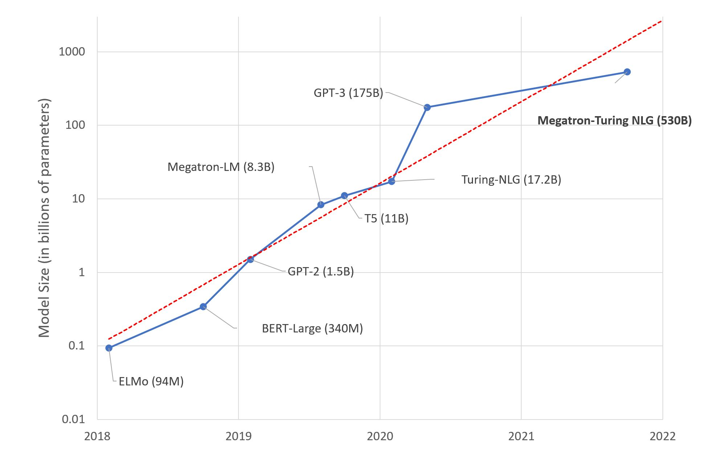

# 课程总结

> 祝愿每个同学都能找到并追求自己的梦想，成为一个愿意站出来颠覆一个行业的人、一个能管理好工程项目的人、一个能能驾驭的了大规模代码的人……用自己的方式去完成那些 “惊为天人” 的东西，推动世界的进步。

> 我们的征途是星辰和大海。因此，对自己要求高一点。

## 从逻辑门到计算机系统

### 数字系统：计算机系统的 “公理系统”  

数字系统 = 状态机

- 状态：触发器
- 迁移：组合逻辑
  - “数码管” 作为第一个例子：UNIX Philosophy 和 “编程” 的力量
  - [NEMU Full System Emulator](https://github.com/NJU-ProjectN/nemu)

数字系统的设计 = 定义状态机

- HDL(Verilog)
- HCL (Chisel)：编译生成 Verilog
- HLS (High Level Synthesis)：“从需求到代码”

### 编程语言和算法

C/Java/Python 程序 = 状态机

- 状态：栈、堆、全局变量
- 迁移：语句 (或语句一部分) 的执行
  - “程序设计语言的形式语义”：hanoi-nr.c 的递归转非递归

编程 = 描述状态机

- 将人类世界的需求映射到计算机世界中的数据和计算
  - 调试理论：Fault, Error 和 Failure
- 允许使用操作系统提供的 API
  - 例子：`write(fd, buf, size)` 持久化数据

### 如何使程序在数字系统上运行？

指令集体系结构

- 在**逻辑门之上建立的 “指令系统”** (状态机)
  - [The RISC-V Instruction Set Manual](https://jyywiki.cn/pages/OS/manuals/riscv-spec.pdf)
  - 既容易用电路实现，又足够支撑程序执行

编译器 (也是个程序)

- 将 “高级” 状态机 (程序) 翻译成的 “低级” 状态机 (指令序列)
  - 翻译准则：external visible 的行为 (操作系统 API 调用) 等价

操作系统 (也是个程序)

- 状态机 (运行中程序) 的管理者
  - 使程序可以共享一个硬件系统上的资源 (例如 I/O 设备)

### 操作系统上的程序

状态机 + 一条特殊的 “操作系统调用” 指令

- syscall (2)：minimal.S（最小的Hello World）

可执行文件

- loader.c：解析 ELF 程序并加载执行

  - “进程初始状态的描述”

  - 动态链接和加载

进程的地址空间

  - pmap 和游戏修改器

### 操作系统对象和 API

OperatingSystem: Three Easy Pieces

- ***Concurrency*** - **thread.h**：打开潘多拉的盒子
- ***Virtualization*** - **sh-xv6.c**：金山游侠、按键精灵和变速齿轮
- ***Persistence*** - **fat-tree.c**

### 获得 “实现一切” 的能力！

M1 - pstree：打印进程树 (文件系统 API; procfs)

M2 - plcs：实现并行计算加速 (线程和同步)

M3 - sperf：strace (pipe; fork; execve)

M4 - crepl：动态链接和加载 (fork; execve; dlopen)

M5 - freov：文件系统解析 (mmap)

### 获得 “理解一切” 的能力

“操作系统” 课给了你程序的 “最底层” 的状态机视角

- 也给了很多之前很难回答问题的答案
  - 如何创造一个 “最小” 的可执行文件？
  - `a.out` 是什么？
  - `a.out` 执行的第一条指令在哪里？
  - `printf` 是如何被调用的？
  - `a.out` 执行了哪些系统调用？
  - `a.out` 执行了多少条指令？

### 理解操作系统如何实现

操作系统实现选讲

- 从 Firmware 到第一个用户程序
- 迷你 “操作系统”：thread-os.c
- 最小的 Linux：还有 “核弹发射器” 驱动
- OSLabs

### 回顾：从逻辑门到计算机系统

刷一下手机，你的计算机系统经历了非常复杂的过程

- 应用程序 (app) → 库函数 → 系统调用 → 操作系统中的对象 → 操作系统实现 (C 程序) → 设备驱动程序 → 硬件抽象层 → 指令集 → CPU, RAM, I/O设备 → 门电路

操作系统课给这个稍显复杂的过程一个清晰的轮廓

- “这一切是可以掌控的”：Ask GPT! RTFM! RTFSC!

  

### Hacker's Delights: 新的“理解”

“一切皆状态机”

- 状态的副本 (fork) 可以用来做什么？
  - Model checking, failure recovery, ...

“死锁检测: lockdep 在每次 lock/unlock 的时候插入一条 printf”

- 这就是 dynamic analysis 的本质
  - 如何减少 printf 的数量、怎么巧妙地记录、怎样分析日志……
  - 如何调控程序的执行？找到 bug 还是绕开 bug？

“文件系统是磁盘上的一个数据结构”

- 通过 append-only 实现 journaling
- LSM Tree 和分布式 key-value store
  - Block chain 也是一个数据结构！

### 并发：走向分布式系统

如何为网络上的多台计算机提供统一的应用程序接口？

- 把多个分布的、随时可能离线的计算机组成一个存储系统
- 在存储的基础上完成计算

### 虚拟化：重新理解操作系统设计

Microkernel, Exokernel, Unikernel

- 没有人规定操作系统里一定要有 “文件”、“进程” 这些对象

### 持久化：重新理解持久存储设计

文件系统没能解决的需求

- 大量的数据 (订单、用户、网络……) + 非简单目录遍历性质的查询

“数据库”：虚拟磁盘上的数据结构

- 就像我们在内存 (random access memory) 上构建各种数据结构
  - Binary heap, binary search tree, hash table, ...
- 典型的数据库
  - 关系数据库 (二维表、关系代数)
  - key-value store (持久化的 `std::map`)
  - VCS (目录树的快照集合)
- SSD 和 NVM 带来的新浪潮

### 和操作系统相关的 Topics

- Computer Architecture：计算机硬件的设计、实现与评估

- Computer Systems：系统软件 (软件) 的设计、实现与评估
- Network Systems：网络与分布式系统的设计、实现与评估
- Programming Languages：状态机 (计算过程) 的描述方法、分析和运行时支持
- Software Engineering：程序/系统的构造、理解和经验
- System/Software Security：系统软件的安 (safety) 全 (integrity)

## jyy 的课程总结

### 上操作系统课的乐趣

> 在课堂上时，你可以思考一些已经很清楚的基本东西。这些知识是很有趣、令人愉快的，重温一遍又何妨？另一方面，有没有更好的介绍方式？有什么相关的新问题？你能不能赋予这些旧知识新生命？……但如果你真的有什么新想法，能从新角度看事物，你会觉得很愉快。
>
> 学生问的问题，**有时也能提供新的研究方向。他们经常提出一些我曾经思考过、但暂时放弃、却都是些意义很深远的问题**，重新想想这些问题，看看能否有所突破，也很有意思。
>
> 学生未必理解我想回答的方向，或者是我想思考的层次；但他们问我这个问题，却往往提醒了我相关的问题。单单靠自己，是不容易获得这种启示的。 —— Richard Feynman

### 六周目的主要改进

课程主线

- 真正实现了 “everything is a state machine”
  - 实现了第五周目立的 flag
  - 一个足够成熟的 model checker
- Jupyter notebook 和 lecture notes 的改进

代码

- 更好的代码示例
- 但似乎因为课时，展示得代码变少了

AI

- Copilot 逐渐应该成为课程的一部分

### 自我批评与七周目

课程主线

- 仍然欠着的代码
  - RAID 模拟器
  - ...
- 重写课程网站/Online Judge
  - 整改项目，再再再次未能如愿
- 还不够 friendly
  - 是的……
- 也许需要一个团队了

其他

- 欢迎大家提建议/意见

## 我们身处的时代

### Google 不是偶然的

### Apple 和 Facebook 不是偶然的

### OpenAI 也不是偶然的

### 一个观点

我们国家需要的

- 面向 “卡脖子” 问题、国家重大战略需求、国民经济主战场，在 ****、*****、**** 的新赛道实现弯道超车

肩负使命的课题组和实验室

- 每年生产 50,000 行低质量代码
  - 50,000 行代码不少
  - 做一些 **incremental/proof-of-concept** 的创新也足够了
- 但**低质量代码改变不了这个世界**
  - Linus Torvalds: Nobody actually creates perfect code the first time around, except me. But there’s only one of me.

### 为什么？

> 历史重复的今天：“多考一分，干掉千人”

潜移默化的价值观和风险观

- 不能容忍任何形式的 “失败”
- 目标就是干掉你的 peers

大学的 “去高考化” 失败

- 卷卷就能保研了，还要什么自行车？
- 一个微妙的 Nash equilibrium：菜鸡互啄的囚徒困境                                                                                                                                                                                                                                                                                                                                                                                                                                                                                                                                                                                                                                                                                                                                                                                                                                                                                                                                              

### 这个世界需要英雄

Bill Gates 在 1975 年开发 Altair BASIC 时在 Harvard 的大型机上实现了全系统模拟器 (Intel 8080A)

- 南京大学《计算机系统基础》课程花了 40 年时间追上

> Remember brick walls let us show our dedication. They are there to separate us from the people who don't really want to achieve their childhood dreams. ——[Randy Pausch's last lecture](https://www.cmu.edu/randyslecture/)

### 去做那个 “全世界只有你相信” 的事

颠覆性的想法 (“那一个” 英雄)

- 10,000 行代码 ← Linux 0.11
- 100,000 行代码
  - 初步的技术壁垒 (产业化的潜力)
- 1,000,000 行代码
  - “三体人的封锁”
  - 反制三体人的必经之路 (“那一些” 无名的英雄)
- 10,000,000 行代码
  - 工业级技术的成熟
