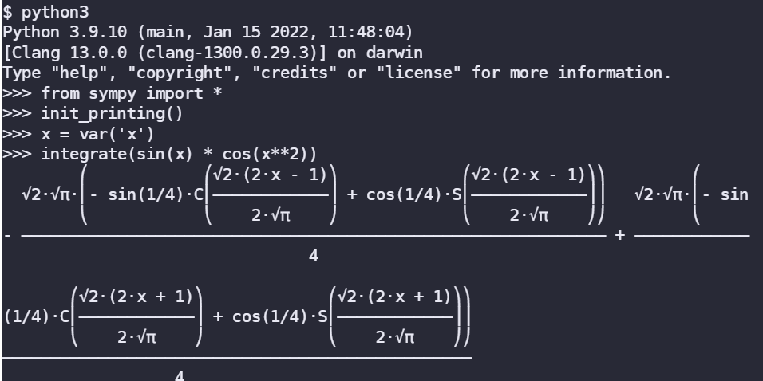

# M4: C Real-Eval-Print-Loop (crepl)

## 1. 背景

大家一定很熟悉编程语言提供的交互式 [read-eval-print-loop](https://en.wikipedia.org/wiki/Read–eval–print_loop) (REPL)，更俗一点的名字就是 “交互式的shell”。

例如我们在课堂上展示的 Python Shell，可以快速帮助大家解决高等数学作业、高精度计算等烦恼：



现代程序设计语言通常都会提供交互式的模式，方便日常使用，包非解释型的程序设计语言也提供类似的设施，例如 Scala REPL、go-eval 等——当然也包括我们的 UNIX Shell！

预期 C 同样也可以实现 “交互式” 的 shell，支持即时定义函数，而且能计算 C 表达式的数值。如果你输入一行代码，比如`strlen("Hello World")`，这段代码会经历 gcc 编译、动态加载、调用执行，最终把代码执行得到的数值 `11` 打印到屏幕上。

## 2. 实验描述

`crepl` - 逐行从 stdin 中输入，根据内容进行处理：

- 如果输入的一行定义了一个函数，则把函数编译并加载到进程的地址空间中；
- 如果输入是一个表达式，则把它的值输出。

解释执行每一行标准输入中的 C “单行” 代码 (假设我们只使用 `int` 类型，即所有输入的表达式都是整数；定义函数的返回值也永远是整数)，分如下两种情况：

- 函数总是以 `int`开头，例如

  ```c
  int fib(int n) { if (n <= 1) return 1; return fib(n - 1) + fib(n - 2); }
  ```

函数接收若干 `int` 类型的参数，返回一个 `int` 数值。如果一行是一个函数，我们希望它将会经过 gcc 编译，并被加载到当前进程的地址空间中。函数可以引用之前定义过的函数。

- 如果一行不是以 int开头，我们认为这一行是一个 C 语言的表达式，其类型为 int，例如

  ```c
  1 + 2 || (fib(3) * fib(4))
  ```

**函数和表达式均可以调用之前定义过的函数**，但不允许访问全局的状态 (变量) 或调用标准 C 中的函数。

如果一行既不是合法的函数 (例如调用了不允许调用的函数)，也不是合法的表达式，`crepl` 可以不保证它们执行的结果 (不一定要报告错误，例如你的程序依然可以照常编译或执行，但你的程序要尽量不会 crash)。

重复定义重名函数你也可以当做 undefined behavior 不必做出过多处理——我们的测试用例中没有这样的情况。

以下是我们的参考实现，它调用了一些外挂程序在终端里实现了语法高亮。

- 没有做语法高亮的必要，我们的环境里没有你需要的运行库，因此会导致你无情的 Compile Error 或 Wrong Answer。
- 如果你使用外挂，一个更好的习惯 (也是编写软件常见的做法) 是在运行时检查外挂是否存在。如果存在则调用；如果不存在则直接输出没有外挂非高亮的版本。


最简的实验要求：你只要你为每一个函数或表达式输出一行即可，例如你可以把你的 crepl 实现成这样：

```c
$ ./crepl-64
int gcd(int a, int b) { return b ? gcd(b, a % b) : a; }
OK.
gcd(256, 144) * gcd(56, 84)
= 448.
```

这个实验表明，编译和解释并没有明确的边界——在 OpenJDK 的实现中，即便是 “解释器” 也是编译的 (只是没有经过优化)。

动态 (just-in-time) 技术在程序运行时 (而非程序执行前) 进行编译，并将编译得到的二进制代码 (指令/数据) 动态加载。

- 最成功的案例之一是 Sun (现在是 Oracle) 的 Java 虚拟机 [HotSpot](https://wiki.openjdk.java.net/display/HotSpot/Main) (现在是OpenJDK的一部分)，另一个最成功的案例是 JavaScript 的 [V8 引擎](https://v8.dev/)


## 3. 正确性标准

- 只要能正确解析单行的函数 (以 `int` 开头)，并且默认其他输入都是表达式即可。
- 输入不合法的 C 代码 (例如不合法的表达式)；你的程序应该给出错误提示而不应该 crash。
- 注意我们允许函数和表达式调用之前 (在 crepl 中) 定义过的函数；
- 可以假设我们输入的命令/表达式数量不超过 100 个；
- 注意你处在的运行目录可能没有写入的权限。建议你将创建的临时文件都放在 `/tmp/` 目录下。建议使用 `mkstemp` family API 创建临时文件；
- 主进程确实求出了所有表达式的值。
- 禁止使用 C 标准库 system 和 popen。

> #### 禁止使用 system() 和 popen()
>
> 调用它们将会导致编译错误。好消息是这个实验我们不禁止 `exec` family 的系统调用：execl, execlp, execle, execv, execvp, execvpe 都是允许的。

## 4. 实验指南

### 4.1 解析读入的命令

框架代码里已经包含了读入命令的循环 (看起来像是一个小 shell)，它打印出一个提示符，然后接受输入并解析：

```
int main(int argc, char *argv[]) {
  static char line[4096];
  while (1) {
    printf("crepl> ");
    fflush(stdout);
    if (!fgets(line, sizeof(line), stdin)) {
      break;
    }
    printf("Got %zu chars.\n", strlen(line)); // WTF?
  }
}
```

当你在终端里按下 Ctrl-d，会结束 stdin 输入流，fgets 会得到 `NULL`。

- fgets 会 flush stdout 的缓冲区。但 C 标准并没有规定这个行为。

### 4.2 把函数编译成共享库

对于一个一行的函数，比如

```c
int gcd(int a, int b) { return b ? gcd(b, a % b) : a; }
```

如何把它编译成共享库？把这个文件保存到临时文件里，例如 `a.c` 中，然后使用正确的选项调用 gcc 即可。

> #### 选取合适的路径和文件名
>
> 可能在一个没有访问权限的工作目录上 (例如文件系统的根 `/`)。在 `/tmp` 中创建临时文件是更安全的做法。此外，glibc 还为我们提供了 `mkstemp` family API 调用，能够帮助我们生成名称唯一的临时文件。

如果我的函数调用了其他函数怎么办？

```c
int foo() { return bar() + baz(); }
```

你不妨试着编译这个程序……它竟然可以被编译！所以忽略所有的 warnings 就好了！

### 4.3 把表达式编译成共享库

> 不需要进行语法解析。

每当我们收到一个表达式，例如 `gcd(256, 144)` 的时候，我们都可以 “人工生成” 一段 C 代码

```c
int __expr_wrapper_4() {
  return gcd(256, 144);
}
```

表达式变成一个函数，我们就可以把它编译成共享库了。把动态库加载到地址空间并得到 `__expr_wrapper_4` 的地址，直接进行函数调用就能得到表达式的值了。

### 4.4 共享库的加载

使用 `dlopen` 加载共享库。我们已经为大家提供了 `-ldl` 的链接选项，大家可以阅读相关库函数的手册。另一个很不错的手册是 elf (5)。

如果你希望理解 dlopen 的原理，不妨参考我们课堂上提供的静态/动态链接加载器——只要正确解析 ELF 文件，你也可以自己实现 dlopen。

- 使用 strace 观察 dlopen 执行的系统调用序列 (只要通过适当的方式，例如你人为调用的系统调用 “标记” dlopen 的开始和结束即可)，更好地理解动态链接和加载的过程；