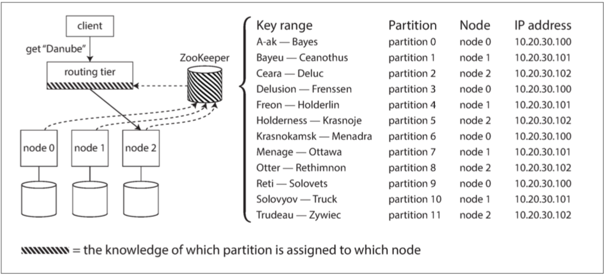

# 分区

> 继续考察数据分布在多台机器间的另一种不同于 **复制** 的形式：将大数据集分割成 **分区**

对于非常大的数据集，或非常高的吞吐量，仅仅进行复制是不够的：我们需要将数据进行 **分区（partitions）**，也称为 **分片（sharding）**。

> #### 术语澄清
>
> 上文中的 **分区（partition）**，在 MongoDB，Elasticsearch 和 Solr Cloud 中被称为 **分片（shard）**，在 HBase 中称之为 **区域（Region）**，Bigtable 中则是 **表块（tablet）**，Cassandra 和 Riak 中是 **虚节点（vnode）**，Couchbase 中叫做 **虚桶（vBucket）**。但是 **分区（partitioning）** 是最约定俗成的叫法。

分区主要是为了 **可伸缩性**。不同的分区可以放在不共享集群中的不同节点上:

- 大数据集可以分布在多个磁盘上，并且查询负载可以分布在多个处理器上。

分区的目标是在多台机器上均匀分布数据和查询负载，避免出现热点（负载不成比例的节点）。主要两种分区方法：

- 键范围分区：键是有序的，并且分区拥有从某个最小值到某个最大值的所有键
  - 有效的范围查询，经常访问相邻的键，则存在热点的风险；分区太大时，需要拆分成两子分区动态地重新平衡分区；
- 散列分区：散列函数应用于每个键，分区拥有一定范围的散列。
  - 范围查询效率低下，但可以更均匀地分配负载；通常先提前创建固定数量的分区，为每个节点分配多个分区，也可以采用动态分区；

复合主键（两种分区搭配使用）：使用键的一部分来标识分区，而使用另一部分作为排序顺序。

次级索引也需要分区，两种方法：

- 基于文档分区（本地索引）：一个分区需要在写入时更新，读取次级索引需要在所有分区之间进行分散 / 收集；
- 基于关键词分区（全局索引）：写入时需要更新多个分区中的次级索引；但是可以从单个分区中进行读取；

最后，是将查询路由到适当的分区的技术，从简单的分区负载平衡到复杂的并行查询执行引擎。

按照设计，多数情况下每个分区是独立运行的（可伸缩性）：

- 写入多个分区的操作结果如果一个成功，一个失败，会发生什么情况，将在下一个章节中讨论该问题。

## 分区与复制

分区通常与复制结合使用，使得每个分区的副本存储在多个节点上。

- 即使每条记录属于一个分区，它仍然可以存储在多个不同的节点上以获得容错能力。

一个节点可能存储多个分区。如果使用主从复制模型，则分区和复制的组合如下图所示：

- 每个分区领导者（主库）被分配给一个节点，追随者（从库）被分配给其他节点。每个节点可能是某些分区的主库，同时是其他分区的从库。
- [第五章](./5_replication.md) 讨论的关于数据库复制的所有内容同样适用于分区的复制。大多数情况下，**分区方案的选择与复制方案的选择是独立的**。

## 键值数据的分区

分区目标是将**数据和查询负载均匀分布**在各个节点上。

-  **偏斜（skew）**：一些分区比其他分区有更多的数据或查询
- **热点（hot spot）**：不均衡导致的高负载的分区

### 根据键的范围分区

一种分区的方法是为每个分区指定一块连续的键范围（从最小值到最大值）， 如 HBase$^{[1]}$；

- 为了均匀分配数据，分区边界需要依据数据调整（手动或自动）；

在每个分区中，我们可以按照一定的顺序保存键（请参阅 “[SSTables 和 LSM-Tree](3_data_store_and_search.md#SSTables 和 LSM-Tree)”）

- **范围扫描**非常简单：将键作为联合索引来处理，以便在一次查询中获取多个相关记录
- **某些特定的访问模式会导致热点**：例如主键是时间戳，按天分区，会导致今天所有写入操作都会转到同一个分区
  - 多级分区：例如先按传感器名称，然后按时间进行分区

### 根据键的散列分区

一个好的散列函数可以将偏斜的数据均匀分布

- 散列函数不需要多么强壮的加密算法：如  MD5 和 Fowler-Noll-Vo 函数；

合适的键散列函数，为每个分区**分配一个散列范围**（而不是键的范围）

- 每个通过哈希散列落在分区范围内的键将被存储在该分区中
- 分区边界可以是均匀间隔的，也可以是伪随机选择的（在这种情况下，该技术有时也被称为 **一致性哈希**$^{[2]}$，即 consistent hashing）。

> #### 一致性哈希
>
> 一致性哈希由 Karger 等人定义$^{[2]}$用于跨互联网级别的缓存系统，使用随机选择的 **分区边界（partition boundaries）** 来避免中央控制或分布式共识。
>
> - 这里的一致性与复制一致性或者ACID一致性无关，只是描述了一种再平衡（rebalancing）的特定方法。

**键散列失去高效执行范围查询**的能力：

- MongoDB 中，如果你使用了基于散列的分区模式，则任何范围查询都必须发送到所有分区$^{[3]}$

**组合索引**方法为一对多关系提供了一个优雅的数据模型

- Cassandra $^{[4]}$中的表可以使用由**多个列组成的复合主键**，只有第一列会作为散列的依据，第一列值固定时，可以执行范围扫描；
- 更新的主键被选择为 `(user_id, update_timestamp)`，那么可以有效地检索特定用户在某个时间间隔内按时间戳排序的所有更新

### 负载偏斜与热点消除

即使Hash分区，极端情况下，所有的读写操作都是针对同一个键，所有的请求都会被路由到同一个分区。

- 数百万追随者的名人用户在做某事时可能会引发一场风暴$^{[5]}$

解决方案：主键的开始或结尾添加一个随机数

- 只要一个两位数的十进制随机数就可以将主键分散为 100 种不同的主键，从而存储在不同的分区中；
  - 读取要从所有 100 个主键分布中读取数据并将其合并；
- 额外的记录：只需要对少量热点附加随机数，跟踪哪些键需要被分割。

## 分区与次级索引

次级索引通常并不能唯一地标识记录，而是一种搜索记录中出现特定值的方式：如查找包含词语 `hogwash` 的所有文章、查找所有颜色为红色的车辆等。

次级索引是关系型数据库的基础，并且在文档数据库中也很普遍

- 许多键值存储（如 HBase）减少实现的复杂度而放弃了次级索引；
- 但一些（如Riak）已经开始添加它们，次级索引也是 Solr 和 Elasticsearch 等搜索服务器的基石；

次级索引的问题是它们**不能整齐地映射到分区**。

有两种用次级索引对数据库进行分区的方法：**基于文档的分区（document-based）** 和 **基于关键词（term-based）的分区**。

### 基于文档的次级索引进行分区

**文档分区索引** 也被称为 **本地索引**（而不是将在下一节中描述的 **全局索引**）：

- 每个分区是完全独立：每个分区维护自己的次级索引，仅覆盖该分区中的文档；
- 查询发送到所有分区，并合并所有返回的结果。

这种查询分区数据库的方法有时被称为 **分散 / 聚集（scatter/gather）**：

- 使次级索引上的读取查询相当昂贵：即使并行查询分区，分散 / 聚集也容易导致**尾部延迟放大**
- MongoDB，Riak ，Cassandra，Elasticsearch 都使用文档分区次级索引。

### 基于关键词(Term)的次级索引进行分区

构建一个覆盖所有分区数据的 **全局索引**，而不是给每个分区创建自己的次级索引（本地索引）。

全局索引也必须进行分区，但可以采用与主键不同的分区方式，**关键词分区（term-partitioned）**

- 寻找的关键词决定了索引的分区方式
- 可以通过 **关键词** 本身或者它的散列进行索引分区

下图是示例：所有分区的红色汽车在红色索引中，并且索引是分区的，首字母从 `a` 到 `r` 的颜色在分区 0 中，`s` 到 `z` 的在分区 1。汽车制造商的索引也与之类似（分区边界在 `f` 和 `h` 之间）

全局索引的优缺点：

- 读取更有效率：不需要 **分散 / 收集** 所有分区，客户端只需要向包含关键词的分区发出请求。
- 写入速度较慢且较为复杂：写入单个文档现在**可能会影响索引的多个分区**

理想情况下，索引总是最新的，写入数据库的每个文档都会立即反映在索引中。

- 关键词分区索引中：跨分区的分布式事务，并不是所有数据库都支持（请参阅 [第七章](7_transaction.md) 和 [第九章](./9_consistency_consensus.md)）
- 在实践中，对全局次级索引的更新通常是 **异步** 的（写入之后读取，可能读取不到）；

## 分区再平衡

**再平衡**：将负载从集群中的一个节点向另一个节点移动的过程

- 查询吞吐量增加：更多的 CPU
- 数据集大小增加：更多的磁盘和内存
- 机器出现故障：其它机器接管

无论使用哪种分区方案，再平衡通常都要满足一些最低要求：

- 再平衡之后，负载（数据存储，读取和写入请求）应该在集群中的节点之间**公平地共享**。
- 再平衡发生时，数据库应该**继续接受读取和写入**。
- 节点之间**只移动必须的数据**，以便快速再平衡，并减少网络和磁盘 I/O 负载。

### 再平衡策略

有几种不同的分区分配方法$^{[6]}$

最好将可能的散列分成不同的范围，并将每个范围分配给一个分区（例如，如果 $0\le hash(key) \le b_0$，则将键分配给分区 0，如果 $b_0\le hash(key) \le b_1$，则分配给分区 1）。

#### 反面教材：hash mod N

模 N（$mod N$）方法的问题是，如果节点数量 N 发生变化，**大多数键将需要从一个节点移动到另一个节点**。

#### 固定数量的分区

> 这个跟按节点比例分区，谁最符合一致性 Hash ？

创建比节点更多的分区，并为每个节点分配多个分区：如在10个节点的集群上，分成1000个分区，每个节点大约100个分区

- 如果一个节点被添加到集群中，新节点可以从当前每个节点中 **窃取** 一些分区，直到分区再次公平分配，如下图所示；
- 从集群中删除一个节点，则会发生相反的情况，将删除节点的分区重新分配到其它节点；

分区的数量不会改变，键所指定的分区也不会改变。唯一改变的是分区所在的节点。

- 变更并不是即时：大量传输数据耗时，在传输过程中，原有分区仍然会接受读写操作；
- 解决集群中的硬件不匹配问题：通过为更强大的节点分配更多的分区，可以强制这些节点承载更多的负载。

分区的数量通常在数据库第一次建立时确定，之后不会改变：

- 原则上可以分割和合并分区，但固定数量的分区在操作上更简单；
- 选择足够多的分区（即最大节点数量）以适应未来的增长，太大的数字带来分区的管理开销；

#### 动态分区

按键的范围进行分区的数据库（如 HBase 和 RethinkDB）会动态创建分区

- 固定边界的固定数量的分区非常不便：如果边界设置错误，可能会导致所有数据都在一个分区中，而其他分区则为空；
- 当分区增长到超过配置的大小时（在 HBase 上，默认值是 10GB），会被分成两个分区，每个分区约占一半的数据$^{[7]}$；
- 如果大量数据被删除并且分区缩小到某个阈值以下，则可以将其与相邻分区合并；

每个分区分配给一个节点，每个节点可以处理多个分区：

- 大型分区拆分后，可以将其中的一半转移到另一个节点，以平衡负载；

动态分区的一个优点是分区数量适应总数据量：

- 少量的数据，少量的分区，管理开销很小；
- 大量的数据，每个分区的大小被限制在一个可配置的最大值；

**预分割**（ pre-splitting）：在一个空的数据库上配置一组初始分区，解决初始分区拆分时的单点瓶颈

- 空的数据库从一个分区开始，直到达到第一个分区的分割点，**所有写入操作都必须由单个节点处理**，而其他节点则处于空闲状态；

动态分区不仅**适用于数据的范围分区**，而且也**适用于散列分区**。

#### 按节点比例分区

固定分区和动态分区的方案中，分区的数量跟节点的数量无关：

- 动态分区，分区的数量与数据集的大小成正比；
- 固定数量的分区，每个分区的大小与数据集的大小成正比；

使分区数与节点数成正比 ：每个节点具有固定数量的分区$^{[8]}$

- 每个分区的大小与数据集大小成比例地增长，而节点数量保持不变；
- 当增加节点数时，随机选择固定数量的现有分区进行拆分，占有一半，留一半在原地；
- 随机化可能会产生不公平的分割，但在更大数量的分区上时，新节点最终从现有节点获得公平的负载份额
  - Cassandra 3.0 引入了另一种再平衡的算法来避免不公平的分割$^{[9]}$；

随机选择分区边界要求使用基于散列的分区（可以从**散列函数产生的数字范围中挑选边界**），符合一致性哈希的原始定义$^{[2]}$（请参阅 “[一致性哈希](#一致性哈希)”）。

### 运维：手动还是自动再平衡

再平衡是一个昂贵的操作，因为它需要重新路由请求并将大量数据从一个节点移动到另一个节点：

- 如果没有做好，这个过程可能会使网络或节点负载过重，降低其他请求的性能。

**全自动再平衡与自动故障检测相结合可能十分危险，导致级联失败**：

- 假设一个节点过载，并且对请求的响应暂时很慢；
- 其他节点得出结论：过载的节点已经死亡，并自动重新平衡集群，使负载离开它；
- 对已经超负荷的节点，其他节点和网络造成额外的负载，使情况变得更糟。

**再平衡的过程中有人参与是一件好事**。这比全自动的过程慢，但可以帮助防止运维意外。

- Couchbase、Riak 和 Voldemort 会自动生成建议的分区分配，但需要管理员提交才能生效。

## 请求路由

当客户想要发出请求时，如何知道要连接哪个节点？随着分区的重新平衡，分区对节点的分配也发生变化。

 **服务发现（service discovery）**：开源发布的对比$^{[10]}$，问题的几种解决方案：

- 允许客户联系任何节点（如 Roubd-Robin Load Balancer）：节点具有请求的分区，则请求，否则转发到对应的节点；
- 路由层：仅负责分区的负载均衡，将客户端请求转到对应的分区；
- 客户端知道分区和节点的分配，直接连接；

许多分布式数据系统都依赖于一个独立的协调服务（所有参与者都达成共识关于分区到节点的映射），如 ZooKeeper 来跟踪集群元数据，如下图所示：

- 每个节点在 ZooKeeper 中注册自己，ZooKeeper 维护分区到节点的可靠映射；
- 其他参与者（如路由层或分区感知客户端）可以在 ZooKeeper 中订阅此信息；

例如，LinkedIn的Espresso使用Helix$^{[11]}$进行集群管理（依靠ZooKeeper），实现路由层；HBase、SolrCloud和Kafka也使用ZooKeeper来跟踪分区分配。

Cassandra 和 Riak 采取不同的方法：他们在节点之间使用 **流言协议（gossip protocol）** 来传播集群状态的变化。

- 请求可以发送到任意节点，该节点会转发到包含所请求的分区的适当节点；
- 在数据库节点中增加了更多的复杂性，但是避免了对像 ZooKeeper 这样的外部协调服务的依赖。

当使用路由层或向随机节点发送请求时，客户端仍然需要找到要连接的 IP 地址：

- 这些地址并不像分区的节点分布变化的那么快，所以使用 DNS 通常就足够了。

### 执行并行查询

目前为止只关注读取或写入单个键的非常简单的查询（加上基于文档分区的次级索引场景下的分散 / 聚集查询），这是大多数NoSQL分布式数据存储所支持的访问层级。

通常用于分析的 **大规模并行处理（MPP, Massively parallel processing）** 关系型数据库产品在其支持的查询类型方面要复杂得多

- 典型的数据仓库查询包含多个连接，过滤，分组和聚合操作；
- MPP 查询优化器将这个复杂的查询分解成许多执行阶段和分区，其中许多可以在数据库集群的不同节点上并行执行；
- 涉及扫描大规模数据集的查询特别受益于这种并行执行。

在 [第十章](./10_batch_processing.md) 讨论并行查询执行的一些技巧。有关并行数据库中使用的技术的更详细的概述，请参阅参考文献$^{[12,13]}$。

## 参考文献

1. “[The Apache HBase Reference Guide](https://hbase.apache.org/book/book.html),” Apache Software Foundation, *hbase.apache.org*, 2014.
2. David Karger, Eric Lehman, Tom Leighton, et al.: “[Consistent Hashing and Random Trees: Distributed Caching Protocols for Relieving Hot Spots on the World Wide Web](http://www.akamai.com/dl/technical_publications/ConsistenHashingandRandomTreesDistributedCachingprotocolsforrelievingHotSpotsontheworldwideweb.pdf),” at *29th Annual ACM Symposium on Theory of Computing* (STOC), pages 654–663, 1997. [doi:10.1145/258533.258660](http://dx.doi.org/10.1145/258533.258660)
3. MongoDB, Inc.: “[New Hash-Based Sharding Feature in MongoDB 2.4](http://blog.mongodb.org/post/47633823714/new-hash-based-sharding-feature-in-mongodb-24),” *blog.mongodb.org*, April 10, 2013.
4. Avinash Lakshman and Prashant Malik: “[Cassandra – A Decentralized Structured Storage System](http://www.cs.cornell.edu/Projects/ladis2009/papers/Lakshman-ladis2009.PDF),” at *3rd ACM SIGOPS International Workshop on Large Scale Distributed Systems and Middleware* (LADIS), October 2009.
5. Samuel Axon: “[3% of Twitter's Servers Dedicated to Justin Bieber](http://mashable.com/2010/09/07/justin-bieber-twitter/),” *mashable.com*, September 7, 2010.
6. Eric Evans: “[Rethinking Topology in Cassandra](http://www.slideshare.net/jericevans/virtual-nodes-rethinking-topology-in-cassandra),” at *ApacheCon Europe*, November 2012.
7. Enis Soztutar: “[Apache HBase Region Splitting and Merging](http://hortonworks.com/blog/apache-hbase-region-splitting-and-merging/),” *hortonworks.com*, February 1, 2013.
8. Brandon Williams: “[Virtual Nodes in Cassandra 1.2](http://www.datastax.com/dev/blog/virtual-nodes-in-cassandra-1-2),” *datastax.com*, December 4, 2012.
9. Branimir Lambov: “[New Token Allocation Algorithm in Cassandra 3.0](http://www.datastax.com/dev/blog/token-allocation-algorithm),” *datastax.com*, January 28, 2016.
10. Jason Wilder: “[Open-Source Service Discovery](http://jasonwilder.com/blog/2014/02/04/service-discovery-in-the-cloud/),” *jasonwilder.com*, February 2014.
11. Kishore Gopalakrishna, Shi Lu, Zhen Zhang, et al.: “[Untangling Cluster Management with Helix](http://www.socc2012.org/helix_onecol.pdf?attredirects=0),” at *ACM Symposium on Cloud Computing* (SoCC), October 2012. [doi:10.1145/2391229.2391248](http://dx.doi.org/10.1145/2391229.2391248)
12. David J. DeWitt and Jim N. Gray: “[Parallel Database Systems: The Future of High Performance Database Systems](https://github.com/Vonng/ddia/blob/master),” *Communications of the ACM*, volume 35, number 6, pages 85–98, June 1992. [doi:10.1145/129888.129894](http://dx.doi.org/10.1145/129888.129894)
13. Shivnath Babu and Herodotos Herodotou: “[Massively Parallel Databases and MapReduce Systems](http://research.microsoft.com/pubs/206464/db-mr-survey-final.pdf),” *Foundations and Trends in Databases*, volume 5, number 1, pages 1–104, November 2013.[doi:10.1561/1900000036](http://dx.doi.org/10.1561/1900000036)