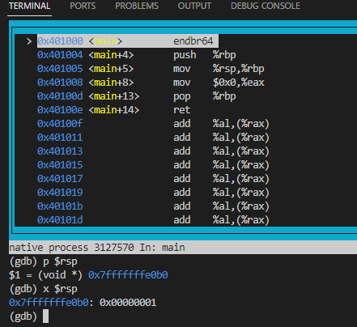

# C/C++ DEBUG

## gdb

> - 编译时 -ggdb 添加调试信息。
> - [gdbgui](https://www.gdbgui.com/) 基于浏览器的 gdb 调试。

- `starti` 可以进行指令执行；
- `layout asm/src` 可以查看相应的汇编/源代码；（如下，查看 $rsp 寄存器的地址所指定的值（main函数的返回地址））



## 异常

### 处理规则

C++中，异常不可以忽略，当异常找不到匹配的catch字句时，会调用系统的库函数`terminate()`（在头文件中）。

默认情况下，terminate（）函数调用标准**C库函数abort（）**使程序终止而退出。

当调用abort函数时，程序不会调用正常的终止函数，**全局对象和静态对象的析构函数不会执行**。


### 设置异常堆栈处理函数

#### std::set_terminate

处理未设置异常处理函数的异常（即通过throw抛出的异常）：

- 对于数组越界异常（未定义行为，Undefined Behavior, UB），无法捕获；


### 异常信号

当程序出现异常时通常伴随着会收到一个由内核发过来的异常信号，如当**对内存出现非法访问时将收到段错误信号SIGSEGV**，然后才退出。

利用这一点，当我们在收到异常信号后将程序的调用栈进行输出，它通常是利用`signal()`函数。


### 异常代码行定位

#### backtrace

**出现崩溃退出时把当前调用栈通过终端打印出来并定位问题的方法**。

在Linux上的C/C++编程环境下，我们可以通过如下三个函数来获取程序的调用栈信息。

```c
#include <execinfo.h>

/* Store up to SIZE return address of the current program state in
   ARRAY and return the exact number of values stored.  */
int backtrace(void **array, int size);

/* Return names of functions from the backtrace list in ARRAY in a newly
   malloc()ed memory block.  */
char **backtrace_symbols(void *const *array, int size);

/* This function is similar to backtrace_symbols() but it writes the result
   immediately to a file.  */
void backtrace_symbols_fd(void *const *array, int size, int fd);
```

它们由GNU C Library提供，关于它们更详细的介绍可参考[Linux Programmer’s Manual](http://man7.org/linux/man-pages/man3/backtrace.3.html)中关于backtrack相关函数的介绍。

`backtrace`需要注意的地方：

- `backtrace`的实现**依赖于栈指针（fp寄存器）**，在gcc编译过程中任何**非零的优化等级（-On参数）**或加入了栈指针优化参数**-fomit-frame-pointer**后多将**不能正确得到程序栈信息**；
- 内联函数没有栈帧，它在编译过程中被展开在调用的位置；
- 尾调用优化（Tail-call Optimization）将复用当前函数栈，而不再生成新的函数栈，这将导致栈信息不能正确被获取。

对于静态链接文件的错误信息，获取到的错误信息如下:

```
Dump stack start...
backtrace() returned 9 addresses
  [00] [0x401806]
  [01] [0x401925]
  [02] [0x40a2a0]
  [03] [0x401793]
  [04] [0x4017cc]
  [05] [0x401988]
  [06] [0x401dda]
  [07] [0x403677]
  [08] [0x401675]
Dump stack end...
```

对于动态链接的错误信息，获取到的堆栈信息如下所示：

```shell
Dump stack start...
backtrace() returned 9 addresses
  [00] ./dynamic.out(+0x12bb) [0x55be3cc4a2bb]
  [01] ./dynamic.out(+0x13da) [0x55be3cc4a3da]
  [02] /lib/x86_64-linux-gnu/libc.so.6(+0x42520) [0x7f1e1c42c520]
  [03] ./libadd.so(add1+0x1e) [0x7f1e1c61e137]
  [04] ./libadd.so(add+0x20) [0x7f1e1c61e170]
  [05] ./dynamic.out(+0x143d) [0x55be3cc4a43d]
  [06] /lib/x86_64-linux-gnu/libc.so.6(+0x29d90) [0x7f1e1c413d90]
  [07] /lib/x86_64-linux-gnu/libc.so.6(__libc_start_main+0x80) [0x7f1e1c413e40]
  [08] ./dynamic.out(+0x11c5) [0x55be3cc4a1c5]
Dump stack end...

Segmentation fault
```

#### addr2line

**通过 `-g`的debug信息**，获取错误的行号信息。

##### 静态链接情况下的错误信息分析定位

编译成一个可执行文件并执行的错误，通过`addr2line`命令可以得到：

```shell
# addr2line -e ${exe_name} ${error_address}
$ addr2line -e static.out 0x401793
# 输出结果类似如下信息，可以看出行号信息
/home/share/work/backtrace/add.c:10
```

##### 动态链接情况下的错误信息分析定位

按照上面方法，得不到正确的信息

```shell
$ addr2line -e dynamic.out 0x7fa4aa022137
??:0
$ addr2line -e libadd.so 0x1e
??:0
```

因为，动态链接库是程序运行时动态加载的，**其加载地址也是每次可能都是不一样**（ASLR：Address Space Layout Randomization）。

注意到`add+0x1c `描述出错的地方发生在符号add1偏移0x1a处的地方，**获取 add1 在程序中的入口地址再加上偏移量0x1a也能得到正常的出错地址**。

**得到函数add的入口地址再上偏移量来得到正确的地址（推荐）**

通过 `nm` 获取符号 `add1` 的地址

```shell
$ nm -n libadd.so | grep add1
0000000000001119 T add1
# add1的地址为 0x1119，然后加上偏移地址0x1a即`0x1119 + 0x1e = 0x1137`，通过 addr2line 可以定位到行。
$ addr2line -e libadd.so 0x1137
~/backtrace/add.c:10
```

#### 示例

*add.c*

```c
#include <stdio.h>
#include <stdlib.h>
#include <unistd.h>
 
int add1(int num)
{
	int ret = 0x00;
	int *pTemp = NULL;
	
	*pTemp = 0x01;  /* 这将导致一个段错误，致使程序崩溃退出 */
	
	ret = num + *pTemp;
	
	return ret;
}
 
int add(int num)
{
	int ret = 0x00;
 
	ret = add1(num);
	
	return ret;
}
```

*dump.c*

```c
#include <stdio.h>
#include <stdlib.h>
#include <unistd.h>
#include <signal.h>	    /* for signal */
#include <execinfo.h> 	/* for backtrace() */
 
#define BACKTRACE_SIZE   16
 
void dump(void)
{
	int j, nptrs;
	void *buffer[BACKTRACE_SIZE];
	char **strings;
	
	nptrs = backtrace(buffer, BACKTRACE_SIZE);
	printf("backtrace() returned %d addresses\n", nptrs);
	strings = backtrace_symbols(buffer, nptrs);
	if (strings == NULL) {
		perror("backtrace_symbols");
		exit(EXIT_FAILURE);
	}
 
	for (j = 0; j < nptrs; j++)
		printf("  [%02d] %s\n", j, strings[j]);
 
	free(strings);
}
 
void signal_handler(int signo)
{
	
#if 0	
	char buff[64] = {0x00};
	sprintf(buff,"cat /proc/%d/maps", getpid());
	system((const char*) buff);
#endif	
 
	printf("\n=========>>>catch signal %d <<<=========\n", signo);
	printf("Dump stack start...\n");
	dump();
	printf("Dump stack end...\n");
 
	signal(signo, SIG_DFL); /* 恢复信号默认处理 */
	raise(signo);           /* 重新发送信号 */
}
```

 *backtrace.c*

```c
#include <stdio.h>
#include <stdlib.h>
#include <unistd.h>
#include <signal.h>	    /* for signal */
#include <execinfo.h> 	/* for backtrace() */
 
extern void dump(void);
extern void signal_handler(int signo);
extern int add(int num);
 
int main(int argc, char *argv[])
{
	int sum = 0x00;
	signal(SIGSEGV, signal_handler);  /* 为SIGSEGV信号安装新的处理函数 */
	sum = add(sum);
	printf(" sum = %d \n", sum);
	return 0x00;
}
```

Makefile

```makefile
all: add dynamic static

add: add.c
	gcc -g -shared -fPIC add.c -o libadd.so

# 只要求出错的 so 有符号信息即可
dynamic: add dump.c backtrace.c	
	gcc dump.c backtrace.c -L./ -ladd -Wl,-rpath,./ -o dynamic.out

static: add dump.c backtrace.c
	gcc -g -static add.c dump.c backtrace.c -o static.out
	
clean:
	rm *.out *.so
```

