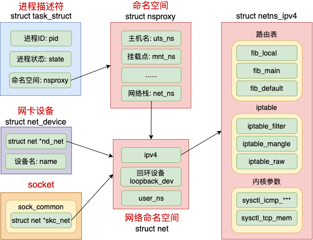

# Namespace

> [相关的示例代码](https://gitee.com/oscsc/cloudnativetech/tree/master/namespace)

进程间隔离，linux内核提供`PID、Mount、UTS、IPC、Network、User` Namespace。


## UTS NameSpace（主机域名）

> 示例：`ns_uts.c`

主机/域名（uts）：UNIX Time-sharing System，在网络上视作独立节点；


## IPC NameSpace（进程通信）

> 示例：`ns_ipc.c`

进程间通信（ipc）：Inter-Process Communication，包括信号、消息队列和共享内存。

- `ipcs/ipcmk/ipcrm` 查看/创建/删除 信号量、消息队列、共享内存；


## User NameSpace（用户/组）

> 示例：`ns_user.c`
>
> Linux 3.8 新增的一种 namespace，用于隔离安全相关的资源，包括 **user IDs and group IDs**，**keys**, 和 **capabilities**。同样一个用户的 user ID 和 group ID 在不同的 user namespace 中可以不一样(与 PID nanespace 类似)。
>
> 换句话说，**一个用户可以在一个 user namespace 中是普通用户，但在另一个 user namespace 中是超级用户**。

隔离安全相关的标识符（identifiers）和属性（attributes），包括用户ID、用户组ID、root目录、key（密钥）以及特殊权限。

- user namespace创建后，第一个进程被赋予该namespace下的所有权限；

- 默认用户显示*65534*，表示尚未与外部namespace用户映射；

- 通过**`uid_map`和`gid_map`**将子进程的`root(0)`和外部进程的`1000`用户绑定；

  - 容器内的root用户创建的文件，在外部看来其用户是1000；
  - 写`gid_map`前，需要先`echo deny > /proc/2506/setgroups`

  > There is a specific limitation added to unprivileged users since Linux 3.19 when **attempting to map the user's group(s): they have to forfeit their right to alter supplementary groups**. This is usually to prevent an user to *remove* itself from a group which acts as a deny filter for files with ownership like `someuser:denygroup` and mode `u=rw,g=,o=r`.

  This is documented in [`user_namespaces(7)`](https://manpages.debian.org/manpages/user_namespaces.7):

  > **Writing "deny" to the `/proc/[pid]/setgroups`** file before writing to `/proc/[pid]/gid_map` will permanently disable `setgroups(2)` in a user namespace and **allow writing to `/proc/[pid]/gid_map` without having the CAP_SETGID capability in the parent user namespace**.


## Net NameSpace（网络）

> `network namespace` 的增删改查功能已经集成到 Linux 的 ip 工具的[ `netns` ](./network.md#netns)子命令。

网络资源的隔离：网络设备，IPV4/IPV6，IP路由表，防火墙，/proc/net目录，/sys/class/net目录，套接字等；

一个**物理的网络设备最多存在一个network namespace**中，可以通过**创建`veth pair`（虚拟网络设备对，类似管道，双向数据传输）在不同的network namespace间创建通道**，达到通信目的。

- 在建立`veth pair`前，新旧namespace通过**管道**进行通信。

Linux 为不同空间创建不同的 struct net 对象：

- 每个 struct net 中都有独立的路由表、iptable 等数据结构；

- 每个设备、每个 socket 上也都有指针指明自己归属那个 netns

通过这种方法从**逻辑上看起来好像是真的有多个协议栈一样**。



## PID NameSpace（PID）

> 示例：`ns_pid.c`

**不同NS下的进程可以有相同的PID**，内核为所有PID NS维护树形结构；

- 父节点可以看到子节点中的进程，通过信号等形式影响子节点的进程，而反之不行；

- PID隔离，需要**配合MOUNT隔离**，将`/proc`文件系统重新挂载；


### Init进程

- **进程号为1的进程需要负责孤儿进程的回收**，因此Docker容器运行多个进程时，最先启动的命令进程应该时具有资源监控和回收等管理能力，如`bash`；
- Init进程具备信号屏蔽，如果未编写处理某个信号的代码逻辑，则同一个Pid namespace下的进程（即使具有超级权限）发给Init进程的信号会被屏蔽，防止被误杀；
- Namespace树中父节点进程发送的信号，只有`SIGKILL`和`SIGSTOP`会被处理，父节点进程有权终止子节点进程；
- 一旦init进程被销毁，同一PID namespace中的其它进程都会受到`SIGKILL`信号而被销毁。

### 隔离特殊性

- 一个进程的PID被认为是常量，因此`setns`和`unshare`调用者无法加入新的PID NS，随后创建的子进程才可以加入新的NS。


## Mount NameSpace（挂载）

> 默认情况下，对于Mount命名空间里的挂载点列表的后续修改，将不会影响到另外命名空间里看到的挂载点列表(除了下面提到的shared subtrees情况)。


### Shared Subtreee

> 引入该机制是为了消除mount ns带来的不便，比如系统新增一块磁盘，**希望所有的NS都感知到新挂载的这块磁盘**，那么如果NS 之间是完全隔离的，就需要每个都执行一次挂载操作。
>
> `cat /proc/self/mountinfo`可以看到，系统默认的挂载点都是shared的。clone系统调用会完全copy父进程的挂载点信息，因此子进程的挂载点也是shared。

#### peer group

表示了一个或多个挂载点的集合，下面两种情况属于**同一group**：

1. 通过`--bind`操作挂载的源挂载点和目标挂载点（前提是源目录是个挂载点）；
2. 生成新`mount ns`时，复制过去的挂载点之间同在一个group。

#### 挂载传播（Mount Propagation）

挂载对象的关系：共享关系，从属关系，私有关系（不可绑定挂载）

- 共享挂载：`mount --make-shared <mount-object>`
- 从属挂载：`mount --make-slave <mount-object>`
- 私有挂载（默认）：`mount --make-private <mount-object>`

挂载状态只可能为以下：

- 共享挂载（shared）：双向传播，一个挂载对象的挂载事件会传播到另一个挂载对象；
- 从属挂载（slave）：单向传播(master-slave)，反之不行；
- 私有挂载（private）：各mount namespace之间相互隔离；
- 不可绑定挂载（unbindable）：不可让其它mount namespace 挂载；

**注意：**

Mount Namespace跟其它Namespace使用不同的地方：

- 对容器进程视图的改变一定要伴随着**挂载操作**才能生效。

即先clone指定`CLONE_NEWNS`标志，然后***在执行/bin/bash前，先挂载目录***。

### 示例

> 代码：ns_mnt.c（需要root权限执行）

因此子进程的挂载点是shared，如果子进程直接`mount proc`之后，父进程的`/proc`也会被改变。

```shell
# 在子进程中的 /proc 的重新挂载，会改变父进程 ps -ef 看到的信息
$ mount -t proc proc /proc
```

- 注意在子命令空间，需要先执行`mount --make-rprivate /`或者`mount --make-private /proc`修改`/proc`的挂载属性为`private`；
- 再执行`mount -t proc proc /proc`；

### 容器镜像（rootfs）

> 挂载在容器根目录上用来为容器进程提供隔离后执行环境的文件系统。

为了让容器的根目录看起来更“真实”，一般会在**容器的根目录下挂载一个完整操作系统的文件系统**。

**新的容器，看到的文件系统是独立的隔离环境，而不是继承宿主机的文件系统，如何实现？**

- 在容器进程启动前，挂载它的整个目录'/'；
- `chroot`：change root file system，改变进程的根目录到指定位置。
  - Docker先使用`pivot_root`系统调用，系统不支持再使用`chroot`。

```shell
# 执行命令（/bin/bash），并将$HOME/test目录作为/bin/bash进程的根目录
chroot $HOME/test /bin/bash
```


## Linux C API（使用）

### 创建NameSpace

#### clone

> int clone(int (*child_func)(void *), void * child_stack, int flags, void *arg);
>
> 在创建新进程的同时创建namespace，flags跟namespace相关的参数有：
>
> - CLONE_NEWIPC, CLONE_NEWNS, CLONE_NEWNET, CLONE_NEWPID, CLONE_NEWUSER, CLONE_NEWUTS

Linux创建新进程的可选参数，比如`PID Namespace : CLONE_NEWPID`

```c
// 新创建的进程会”看到“全新的进程空间，在这个进程空间里，其PID为1，通过ps等看不到宿主机的进程空间
// 但是在宿主机里，其PID还是真实的数值，比如100
int pid = clone(main_function, stack_size, CLONE_NEWPID | SIGCHLD, NULL);
```

`unshare`：在原先进程上实现隔离，不需要创建新的进程。

- PID：原先进程不进入新的PID NameSpace，后续创建的**子进程**才进入（即**新namespace中的init进程**）；
- 其它名空间：原进程直接进入新的Namespace；

#### fork

fork的返回值：

- 父进程返回新创建子进程的进程PID，子进程中返回0；

fork()执行后，父进程有义务监控子进程的运行状态，并在子进程退出后自己才能正常退出，否则子进程会变成”孤儿“进程。


### 查看NameSpace

进程的每种Linux NameSpace在对应的`/proc/[进程号]/ns`下有虚拟文件，链接到真实的NameSpace文件。

```shell
lrwxrwxrwx 1 mtk mtk 0 10月 30 10:55 cgroup -> 'cgroup:[4026531835]'
lrwxrwxrwx 1 mtk mtk 0 10月 30 10:55 ipc -> 'ipc:[4026531839]'
lrwxrwxrwx 1 mtk mtk 0 10月 30 10:55 mnt -> 'mnt:[4026531840]'
lrwxrwxrwx 1 mtk mtk 0 10月 30 10:11 net -> 'net:[4026532008]'
lrwxrwxrwx 1 mtk mtk 0 10月 30 10:11 pid -> 'pid:[4026531836]'
lrwxrwxrwx 1 mtk mtk 0 10月 30 10:55 pid_for_children -> 'pid:[4026531836]'
lrwxrwxrwx 1 mtk mtk 0 10月 30 10:55 time -> 'time:[4026531834]'
lrwxrwxrwx 1 mtk mtk 0 10月 30 10:55 time_for_children -> 'time:[4026531834]'
lrwxrwxrwx 1 mtk mtk 0 10月 30 10:11 user -> 'user:[4026531837]'
lrwxrwxrwx 1 mtk mtk 0 10月 30 10:55 uts -> 'uts:[4026531838]'

```

### 加入 NameSpace

#### setns

> int setns(int fd, int nstype);
>
> 系统调用，从原先的namespace加入新的namespace中
>
> - fd : 加入namespace的文件描述符，及`/proc[pid]/ns`目录下的对应文件；
> - 同`unshare`，但是原进程不入新的NS（包括PID），创建子进程才入新的NS（包括PID）；

`exec`族的函数(`execv, execvp, execl, execlp`)执行命令。

- `exec`：C程序立即被实际命令替换，即`exec**`之后的代码不会执行，如果需要控制，可以使用`fork-exec`机制；命令执行失败，返回-1；

示例如下：`./setns-test /proc/27342/uts /bin/bash`

```c++
#define _GNU_SOURCE
#include <fcntl.h>
#include <stdio.h>
#include <sched.h>
#include <signal.h>
#include <unistd.h>

#define errExit(msg) do { perror(msg); exit(EXIT_FAILURE); } while (0)

int main(int argc, char* argv[]) {
    int fd = open(argv[1], O_RDONLY);  /* 获取namespace文件描述符 */
    if (setns(fd, 0) == -1) {          /* 加入新的namespace */
        errExit("setns");
    }
    execvp(argv[2], &argv[2]);		   /* 执行程序 */
    errExit("execvp");				   /* 命令执行成功时，此行不会执行 */
}
```

#### unshare

>int unshare(int flags);
>
>在原先的进程上进行namespace隔离（不包括PID）。
>
>- flags : namespace的类型（即 CLONE_NEW* ）

